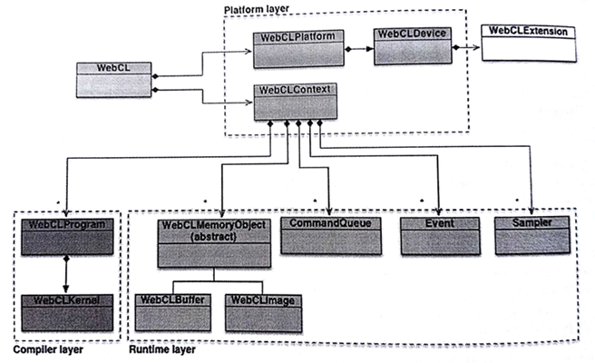

#12.2 如何使用WebCL编程

WebCL 1.0其实就是使用JavaScript实现的OpenCL 1.2。这就意味着调用同样的OpenCL API、语法以及运行时，无需太多行代码就能完成(JavaScript是面向对象的语言)。我们通常会将WebCL与其他类似的技术联系在一起进行比较。如果你对WebGL很不了解，对于讨论WebCL也是没有关系的。

与OpenCL一样，WebCL的编程也是由两部分构成：

1. 主机端(例如，Web浏览器)用来控制和执行JavaScript程序
2. 设备端(例如，GPU)用来进行计算——OpenCL内核

和WebGL一样，WebCL也属于窗口对象的特性。首先，我们要检查WebCL是否可用，如果可用，则创建对应的上下文对象：

```javaScript
// First check if the WebCL extension is installed at all
if (window.webcl == undefined){
  alert("Unfortunately your system does not support WebCL." +
  "Make sure that you have both the OpenCL dirver" +
  "and the WebCL browser extension installed.");
}

// Get a list of available CL platforms, and another list of the
// available devices on each platform. If there are no platforms
// or no available devices on any platform, then we can conclude
// that WebCL is not available
webcl = window.webcl
try{
  var platforms = webcl.getPlatforms();
  var devices = [];
  for (var i in platforms){
    var p = platforms[i];
    devices[i] = p.getDevices();
  }
  
  alert("Excellent! Your system does support WebCL");
} catch(e){
  alert("Unfortunately platform or device inquiry failed.");
}

// Setup WebCL context using the default device
var ctx = webcl.createContext();
```



图12.1 WebCL对象


图12.1中描述了WebCL中的对象结构关系。注意WebCL是接口的名字，而webcl是JavaScript的对象。更多信息可以查阅WebCL的标准[1]。

Web应用无法获取平台信息之后，列出所有可以用的设备；而是通过获取到的设备信息了解对应平台，从而指定对应的设备或平台。

```javaScript
// Find appropriate device
for (var j = 0, jl = device.length; j < jl; ++j){
  var d = devices[j];
  var devExts = d.getInfo(cl.DEVICE_EXTENSIONS);
  var devGMem = d.getInfo(cl.DEVICE_GLOBAL_MEM_SIZE);
  var devLMem = d.getInfo(cl.DEVICE_LOCAL_MEM_SIZE);
  var devCompUnits = d.getInfo(cl.DEVICE_MAX_COMPUTE_UNITS);
  var devHasImage = d.getInfo(cl.DEVICE_IMAGE_SUPPORT);
  
// select device that matches your requirements
  platform = ...
  device = ...
}

// assuming we found the best device, we can create the context
var context = webcl.createContext(platform, device);
```

应用会在运行时对OpenCL对象进行管理，比如：命令队列、内存对象、程序对象、内核对象，以及入队命令(比如：执行内核、读取内存对象或写入内存对象)。

WebCL中定义了如下对象：

- **命令队列**
- 内存对象(**数组**和**图像**)
- **采样器**对象，其描述了在内核中如何对图像进行读取
- **程序**对象，其包含了一些列内核函数
- **内核**对象，在内核源码中使用__kernel声明的函数，其作为真正的执行对象
- **事件**对象，其用来追踪命令执行状态，以及对一个命令进行性能分析
- 命令同步对象，比如**标记**和**栅栏**

首先我们需要创建程序对象。WebCL与WebGL 1.0类似，假设可以提供一段内核源码。这样的话，Web应用就需要内嵌一个编译器。源码先从设备上进行载入，之后进行编译。和其他编译器一样，OpenCL编译器也定义了一些编译选项。

```javaScript
// Create the compute program from the source strings
program = context.createProgram(source);

// Build the program executable with relaxed math flag
try{
  program.build(device, "-cl-fast-relaxed-math");
} catch(err) {
  throw 'Error building program:' + err + program.getBuildInfo(device, cl.PROGRAM_BUILD_LOG);
}
```

如此这般，我们的程序就可以编译了，并且一个程序对象内具有一个或者多个内核函数。这些内核函数作为我们程序的入口函数，就如同静态库中的接口一样。为了区别不同的内核函数，我们需要创建WebCLKernel对象：

```javaScript
// Create the compute kernels from within the program
var kernel = program.createKernel("kernel_function_name");
```

就像普通函数一样，内核函数通常都会有一些参数。JavaScript会提供一些数据类型，typed arrays[2]就是用来传递不同类型的内核参数(具体参数类型见表12.1)。对于其他类型的数据，我们可以使用WebCL对象：

- WebCLBuffer和WebCLImage，可以用来包装数组
- WebCLSampler可以对图像进行采样

一个WebCLBuffer对象可以将数据以一维的方式存储起来。数组中错存储的元素类型都可以使标量类型(比如：int或float)，向量类型，或是自定义结构体类型。

表12.1 在setArg()中使用的webcl.type与C类型之间的关系

内核参数类型|setArg()值的类型|setArg()数组类型|注意
----|----|----|----
char, uchar|scalar|Uint8Array, Int8Arrary|1 byte
short, ushort|scalar|Uint16Array, Int16Array|2 bytes
int, uint| scalar|Uint32Array, Int32Array|4 bytes
long, ulong |scalar|Uint64Array, Int64Array|8 bytes
float | scalar|Float32Array|4 bytes
charN|vector|Int8Array for (u)charN|N = 2,3,4,8,16
shortN|vector|Int16Array for (u)shortN|N = 2,3,4,8,16
intN|vector|Int32Array for (u)intN|N = 2,3,4,8,16
floatN|vector|Float32Array for floatN and halfN|N = 2,3,4,8,16
doubleN|vector|Float64Array for (u)doubleN|N = 2,3,4,8,16
char, ..., double *|WebCLBuffer||
image2d_t| WebCLImage||
sampler_t|WebCLSampler||
__local||Int32Array([size_in_bytes])|内核内部定义大小

```javaScript
// Create a 1D buffer
var buffer = webcl.createBuffer(flags, sizeInBytes, optional srcBuffer);

// flags:
// webcl.MEM_READ_WRITE Default. Memory object is read and written by kernel
// webcl.MEM_WRITE_ONLY Memory object only writeten by kernel
// webcl.MEM_READ_ONLY Memory object only read by kernel
// webcl.MEM_USE_HOST_PTR Implementation requests OpenCL to allocate host memory
// webcl.MEM_COPY_HOST_PTR Implementation requests OpenCL to allocate host memory and copy data from srcBuffer memory. srcBuffer must be specified
```

注意，只有从内存对象或其子对象中读取数据，或读取多个具有重叠区域的子内存对象是有定义的。其他方式的并发读写都会产生未定义的行为。

WebCL图像对象可以存储1,2,3维的纹理，渲染内存或图像。图像对象中的元素可以从预定义的图像格式列表中选择。当前的WebCL版本最多只支持到二维图像。

```javaScript
// create a 32-bit RGBA WebCLImage object
// first, we define the format of the image
var imageFormat = {
  // memory layout in which pixel data channels are stored in the image
  'channelOrder':webcl.RGBA,
  // type of the channel data
  'channelType':webcl.UNSIGNED_INT8,
  // image size
  'width':image_width,
  'height':image_height,
  // scan-line pitch in bytes.
  // If imageBuffer is null, which is the default if rowPitch is not specified.
  'rowPitch'：image_pitch
};

// Image on device
// imageBuffer is a typed array that contain the image data already allocated by the application
// imageBuffer.byteLength >= rowPitch * image_height. The size of each element in bytes must be a power of 2.

var image = context.createImage(webcl.MEM_READ_ONLY | webcl.MEM_USE_HOST_PTR, imageFormat, imageBuffer);
```

WebCLSampler告诉内核函数读和对图像数据进行读取。WebCL的采样器和WebGL的采样器类似。

```javaScript
// create a smpler object
var sampler = context.createSampler(normalizedCoords, addressingMode, filterMode);
// normalizedCoods indicates if image coordinates specified are normalized.
// addressingMode indicated how out-of-range image coordinations are handled when reading an image.
// This can be set to webcl.ADDRESS_MIRRORED_REPEAT
// webcl.ADDRESS_REPEAT, webcl.ADDRESS_CLAMP_TO_EDGE,
// webcl.ADDRESS_CLAMP and webcl.ADDRESS_NONE.
// filterMode specifies the type of filter to apply when reading an image. This can be webcl.FILTER_NEAREST or webcl.FILTER_LINEAR
```

使用WebCLKernel.setArg()将标量、向量或内存对象以参数的形式传入内核。需要传递局部内存时，我们可以使用长度为1的Int32Array，其中的数值是需要分配多少字节的局部内存，因为局部内存不能在主机端或设备端初始化，不过主机端可以通过内核参数的形式告诉设备端要分配多少局部内存。

根据经验内核所需要的所有参数，都需要是一个对象。即使是标量也也要包装在长度为1的数组中。向量根据长度放置在数组中。数组、图像和采样器都是WebCL对象。内存对象(数组和图像)需要在内核执行命令入队前，通过主机内存转移到设备内存。

这里展示一个例子:

```javaScript
// Sets value of kernel argument idx with value as memory object or sampler
kernel.setArg(idx.a_buffer);
kernel.setArg(idx.a_image);
kernel.setArg(idx.a_sampler);

// Sets value of argument 0 to the integer value 5
kernel.setArg(0, new Int32Array([5]));

// Sets value of argument 1 to the float value 1.34
kernel.setArg(1, new Float32Array([1.34]));

// Sets value of argument 2 as a 3-float vector
// buffer should be  a Float32Array with 3 floats
kernel.setArg(2, new Float32Array([1.0, 2.0, 3.0]));

// Allocate 4096 bytes of local memory for argument 4
kernel.setArg(3, new Int32Array([4096]));
```

当需要传递一个标量时，需要告诉程序内核标量数据的类型。JavaScript只有一种类型——数字——所以我们需要通过setArg提供数据类型信息。

注意：

- 长整型是64位整数，其无法在JavaScript中表示。其只能表示成两个32位整数：低32位存储在数组的第一个元素中，高32位存储在第二个元素中。
- 如果使用__constant对内核参数进行修饰，那么其大小就不能超多webcl.DEVICE_MAX_CONSTANT_BUFFER_SIZE。
- OpenCL允许通过数组传递自定义结构体，不过为了可移植性WebCL还不支持自定义结构体的传递。其中很重要的原因是因为主机端和设备端的存储模式可能不同(大端或小端)，其还需要开发者对于不同端的设备进行数据整理，即使主机和设备位于同一设备上。
- 所有WebCL API都是线程安全的，除了kernel.setArg()。不过，kernel.setArg()在被不同的内核对象并发访问的时候也是安全的。未定义的行为会发生在多个线程调用同一个WebCLKernel对象时。

WebCL的对象中，命令队列中包含一系列操作和命令。应用可能使用多个独立的命令队列，直到其中有数据共享时才进行同步。

命令需要有序入队，不过在设备端可能是顺序执行(默认)，或者是乱序执行。乱序意味着当命令队列中包含两个命令A和B时，顺序的执行能保证A一定能在B之前执行，而乱序的话就不能保证A和B结束的顺序。对于乱序队列，可以使用等待事件或入队一个栅栏命令，来保证命令的之间的依赖顺序。乱序队列属于进阶的主题，本章我们就不再进行描述。对其感兴趣的读者可以去[这里](http://sa09.ida.ucdavis.edu/docs/SA09-opencl-dg-events-stream.pdf)[3]看看。目前很多的OpenCL实现并不支持乱序队列。你可以尝试使用`QUEUE_OUT_OF_ORDER_EXEC_MODE_ENABLE`测试一下OpenCL实现是否支持乱序队列。如果得到的是`INVALID_QUEUE_PROERTIES`异常抛出的话，那么你所使用的设备就不支持乱序队列。

```javaScript
// Create an in-order command-queue(default)
var queue = context.createCommandQueue(device);

// Create an in-order command-queue with profiling of commands enabled
var queue = context.createCommandQueue(device, webcl.QUEUE_PROFILING_ENABLE)；

// Create an out-of-order command-queue
var queue = context.createCommandQueue(device, webcl.QUEUE_OUT_OF_ORDER_EXEC_MODE_ENABLE);
```

命令队列在指定设备上创建。多个命令队列具有其相对应的设备。应用可以通过主机端和设备端的数据传输，重叠的执行内核。图12.2展示了将问题分成两部分可能会更快的完成：


- 第一部分是主机端向设备端传输数据，在分解之后只需要原来拷贝时间的一半即可完成工作。然后，执行内核，基本上也是一半的时间完成。最后将数据传回主机，同样还是原先一半的时间。
- 第一个传输数据完成后，第二个才开始，有些类似于CPU的流水线。

当有一系列命令入队后，使用WebCL中的enqueueNDRange(kenrel, offsets, globals, locals)就能执行对应的命令:

- kernel——执行命令的内核对象。
- offsets——对全局区域的偏移。如果传null，则代表offsets=[0, 0, 0]。
- globals——内核所要解决问题的尺寸。
- locals——每个维度上的工作组中，工作项的数量。如果传null，设备会对其自行设定。

例如，如果我们要操作一个宽度width，高度为height大小的图像，那么globals可以设置为[width, height]，locals是可以设置为[16, 16]。这里需要注意的是，如果enqueuNDRange()中locals的大小超过了webcl.KERNEL_WORK_GROUP_SIZE，enqueuNDRange()就会执行失败。

-----------

[1] WebCL 1.0 Specification, http://www.khronos.org/registry/webcl/specs/latest/1.0

[2] Typed Array Specification, http://www.khronos.org/registry/typedarray/specs/latest

[3] Derek Gerstmann Siggraph Asia 2009 on Advanced OpenCL Event Model Usage, http://sa09.ida.ucdavis.edu/docs/SA09-opencl-dg-events-stream.pdf