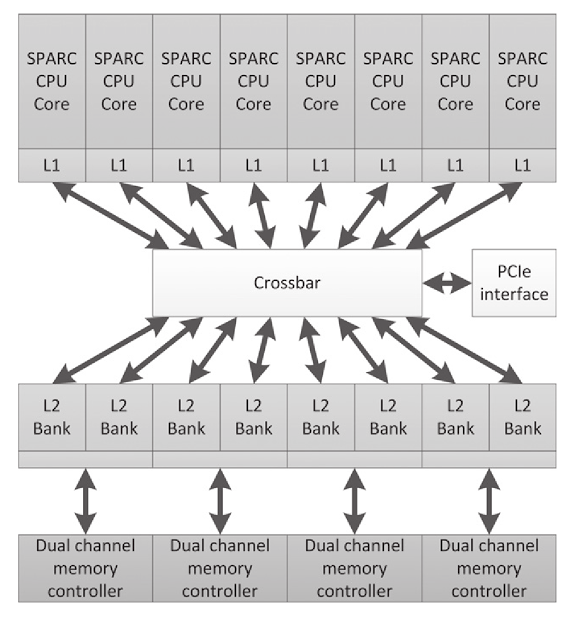

#2.3 架构设计空间

现实世界中，我们所见的架构远比之前提到架构复杂。我们所使用的计算机架构在各个方面都会发生很大的变化，具有很大的设计空间。即便是当前公开的架构，在很多地方都有不同。

这有助于我们了解，当前一些人对于架构的观点过于简单。例如，在GPU领域，我们经常会遇到下面的几种情况：

- CPU是串行的，GPU是并行的

- CPU只有几个核，GPU有数百个核

- CPU只能运行一两个线程，GPU可以运行成千上万个线程

当然，现实中的设计要远比上面描述复杂的多，比如，缓存内部的差异、流水线的数量、流水线的类型，等等。本章的主题就是要来聊一下CPU和GPU的异同，或者说大多数当代架构。目前我们能够看到的架构只是进行了简单的分类，只是对一些基本设计进行参数化设计的组合。程序员需要了解这其中的差异：只有专家才会去关心内存大小和硬件协作指令的比例关系。

本节中，我们将会讨论一些实际存在的架构，还会聊一聊哪里适用于对应的架构，以及根据我们之前谈论到的特性来权衡这些架构。希望本章的内容能更好的帮助你权衡架构，以及在实际架构上，帮助你识别哪些算法适合或不适合这种架构。(宽SIMD和状态存储GPU设计要沿着CPU的路走很长的一段时间(比如：高性能和易用性)，设计架构的选择也是硬件是否能达到最佳的性能决定因素。)

##2.3.1 CPU设计

很多人都在称为“CPU”的设备上进行过开发。即使在CPU上，使用并行的方式也是大相径庭额。

**低功耗CPU**

在功耗要求非常非常低的时候，CPU核会设计的很简单，如果有多个也是多个串行使用。在这种情况下，功耗在设计中就是最关键的因素，性能则为次要因素。这样的设计通常不支持浮点计算，且无需并行化。

目前通常使用低功耗CPU ISA总线使用的是ARM ISA架构(ARM对该架构拥有知识产权)。ARM架构起源于艾康RISC机，其实就是[艾康电脑](https://zh.wikipedia.org/wiki/%E8%89%BE%E5%BA%B7%E9%9B%BB%E8%85%A6)的桌面架构，不过目前这种简单的架构是移动端和嵌入式领域的主要架构。DEC生产出了[StrongARM微处理](https://zh.wikipedia.org/wiki/StrongARM)后，在1996到1998年期间，艾康也确实进军过桌面领域。ARM有各式各样的设计方式，因为ISA协议允许制造商对自己的芯片进行自由设计。通常，ARM的核芯会和其他功能单元一起放在一个芯片上，比如：蜂窝调制解调器、嵌入式图像处理器和视频加速器，等等。

大多数ARM ISA的变种架构都会在其核芯上排布三到七阶流水线。基于ARMv7 ISA架构的Cotex-A8，Cotex-A9和Cotex-A15核都支持超标量，且使用了高达4个对称核芯。基于ARMv7的核芯可以选择性的支持NEON SIMD指令，每个核上可以执行64bit和128bitSIMD操作。

ARMv8-A架构增加了64bit指令集，NEON扩展支持128bit寄存器，支持双精度和密码指令。基于ARMv8-A架构的高端处理器Cortex-A57，目标是中等性能，8路宽指令，低功耗，还有一条乱序流水线。Cortex-A53中保留了顺序流水线，不过这条流水线只支持2路宽指令。

图2.7中的彪马微架构就是AMD当前低功耗CPU阵营中的一员，其功耗在2~25瓦之间。为了实现低功耗设计，彪马核芯的时钟要比高端产品慢很多，并且设计以尽可能低的峰值性能，减少数据路径上的开销。彪马是一款64bit设计，支持双通道乱序执行，并且具有2个128bitSIMD单元，将这两个单元拼接起来，就能执行AVX指令操作。

Intel的[Atom设计](https://zh.wikipedia.org/wiki/%E8%8B%B1%E7%89%B9%E7%88%BEAtom)使用了与AMD彪马不同的方式，所得到的性能也不一样。在[Silvermont微架构](https://en.wikipedia.org/wiki/Silvermont)之前，Atom并不支持乱序执行，使用SMT来弥补单线程的性能不足。自从Silvermont出世，Intel和AMD对于功耗和性能的技术性权衡几乎一样了。

通常，低功耗CPU只能进行顺序或窄乱序执行(使用相关窄SIMD单元)。核芯数量的变化在多线程情况下可对各种“性能-功耗”平衡点进行缩放。总之，性能简单和主频较低(相较桌面级CPU)，都是减少功率消耗的一种方式。

**主流桌面CPU**

主流桌面级CPU的两大主要品牌——AMD和Intel，在架构设计上两家的CPU架构和彪马的设计差不多。不同的情况下，他们会增加CPU中不同元素的复杂度。

[Haswell微架构](https://zh.wikipedia.org/wiki/Haswell%E5%BE%AE%E6%9E%B6%E6%A7%8B)是当前Intel核的主流架构。之前几代，比如Sandy Bridge[4]和Ivy Bridge，支持128bit SSE操作和256bit AVX操作。Haswell[5]添加了对AVX2(AVX的升级版，支持更多的整型操作指令)的支持。Haswell流水线可以并行执行8个不同类型的操作，功能单元通过8个调度口进行连接，完成类型混合的操作。其乱序引擎可以在单位时间内处理192个操作。

Intel为Nehalem处理器(Sandy Bridge系处理器)增加了硬件多线程，并且在Sandy Bridge和Haswell架构上都保留了硬件多线程。这种情况下，就是真正的SMT：每个核上的执行单元可以处理来自不同线程的不同操作。这提升了功能单元的利用性，也增加了调度的复杂度。

AMD的[压路机](https://zh.wikipedia.org/wiki/AMD_Steamroller)(Steamroller)(图2.7)增加了线程执行的数量，其使用的方法介于增加核的数量和增加核芯上的线程数之间。推土机的这种方式让整数核芯二次独立，使其拥有私有ALU、状态寄存器和调度器。不过，取指单元、浮点ALU和二级高速缓存还是在核芯间共享的。AMD参考了这种共享方式，将两个核芯设计为一个“模块”。设计模块的目的只共享多个功能单元，从而减少在实际负载中对资源的严重竞争。在之前的[推土机](https://zh.wikipedia.org/wiki/AMD_Bulldozer)(Bulldozer)和[打桩机](https://zh.wikipedia.org/wiki/AMD_Piledriver)(Piledriver)微架构中，解码单元和两个核芯组成一个模块。不过，在压路机架构下，解码单元已经在多个核之间复用了。

通过4个ALU流水线，每个核都能支持乱序执行。共享的浮点ALU为一对128bit SIMD单元的合并，可用来执行AVX指令。为了节省在移动设备上的功耗，压路机微架构也引入了可以动态调整大小的二级高速缓存——其中部分功能可以根据工作负载进行关闭。

我们了解了主流CPU中的多宽指令执行，乱序硬件，高频时钟和大量缓存——所有性能都用来维持在合理的功耗下单线程的高性能。主流桌面级CPU中，核内多线程是很少见或不存在的，并且芯片内SIMD单元可以设置宽度，这样就不会再不用的时候，浪费芯片的面积。

**服务器CPU**

Intel安腾架构和其子代架构是非常成功的(最新版本是安腾9500)，其基于VLIW[6]技术，是Intel对主流服务器处理器的一次有趣的尝试。安腾架构中有很多的寄存器(128个整型寄存器和128个浮点寄存器)。该架构使用的是一种VLIW名为EPIC(Explicityly Parallel Instruction Code，并行指令代码)，这种该指令能一次存储3个128bit的指令束。CPU每个时钟周期会从L1缓存上取四个指令束，这样就能在一个时钟周期内执行12个指令。这种处理有效的将多核和多插口服务器结合起来。

EPIC将并行化的问题从运行时转移到编译时，这样反馈信息就可以从编译器的执行跟踪进行获取。这就要让编译器完成将指令打包成VLIW或EPIC指令包，这样的结果编译器的好与坏，直接影响到该架构的性能。为了协助编译器，大量的执行掩码，束间依赖信号，预取指令，推测式加载，以及将循环寄存器文件构建入架构。为了提升处理器的吞吐量，最新的安腾微架构包含了SMT，安腾9500支持前端流水线和后端流水线独立执行。

[SPARC T系列](https://en.wikipedia.org/wiki/SPARC_T-Series)(如图2.9所示)，其起源于[Sun](https://zh.wikipedia.org/wiki/%E6%98%87%E9%99%BD)，后在[Oracle](https://zh.wikipedia.org/wiki/%E7%94%B2%E9%AA%A8%E6%96%87%E5%85%AC%E5%8F%B8)进行开发，其使用多线程的方式为服务器的工作负载计算吞吐量[7]。

很多服务器上的负载都是多线程的，特别是事务和网页负载，都会有大量的线程同时对服务器内存进行访问。[UltraSPARC](https://zh.wikipedia.org/wiki/SPARC) Tx系列和之后的SPARC Tx系列CPU的设计，使用最低的性能开销来负载对应数量的线程，使CPU整体吞吐量保持最大化，每一个核都设计的简单高效，无乱序执行逻辑。这种设计一直保持到SPARC T4。之后，每个核中开始出现线程级并行，这种方式能够在只有双流水线的处理器上交替的执行8个线程上的操作。这种设计能很好的隐藏指令延迟，并且比起主流x86的逻辑设计要简单许多。更加简单的SPARC T5设计上，每个处理器有16个核芯。

图2.9 Niagara 2 CPU来自Sun/Oracle。该设计是为了让高端线程更加高效。需要注意的是，该设计和图2.8中的GPU设计有些类似。设计能给予足够多的线程，线程计算的时间能很好的对访存的时间进行掩盖，即使很复杂的硬件技术都没必要使用指令级别的并行。

为了支持多个活动线程，SPARC架构需要多组寄存器，不过作为权衡因素，其推测性寄存存储方式要少于超标量设计。另外，协处理器可以对密码操作进行加速，并且片上以太网控制器可以提高网络吞吐量。

如之前所述，最新的SPARC T4和T5有点回退到早前的多线程设计。每个CPU核支持乱序执行，并且可以从单线程模式(单线程可以使用所有资源)切换到多线程模式。从这个意义上来说，SPARC架构与现代另一种SMT设计越来越接近，SMT设计的代表就是Intel和CPU。

通常，服务器芯片以一些单线程性能为代价，换取最大化的并行性。与桌面级芯片不同，服务器芯片上的面积会更多的用来支持不同线程间的上下文切换。随着宽指令逻辑的出现(比如安腾处理器)，其能帮助编译发现指令级别的并行。

##2.3.2 GPU架构

比起CPU架构，GPU架构有很宽泛的选择。深入讨论OpenCL编程(第8章)之前，我们来讨论其中几种架构。GPU倾向于使用复杂的硬件来进行多线程任务管理，因为显卡需要处理的项目很多，包括处理复杂图形、几何图形和图像像素。都是可高度并行的任务，其中大量任务都可以使用(高延迟容忍)多线程来完成。需要了解的是，除了管理任务队列的复杂机制，或在硬件管理系统后隐藏SIMD指令的执行外，其实GPU是很简单的多线程处理器，对其进行参数指定之后，能高效的处理大量像素。

**移动端GPU**

移动端GPU也具有通用计算能力，包括ARM，[Imagination Technologies](https://zh.wikipedia.org/wiki/Imagination_Technologies)，[联发科技](https://zh.wikipedia.org/wiki/%E8%81%AF%E7%99%BC%E7%A7%91%E6%8A%80)和高通(https://zh.wikipedia.org/wiki/%E9%AB%98%E9%80%9A)提供的GPU都能够兼容OpenCL。GPU由多个小的着色核组成，小尺寸SIMD单元上可以执行大量的独立线程(不一定使用同一个SSE矢量流水线)。ARM的Mali-T760架构使用三种计算流水线，每个流水线上有16个着色核。核间任务管理支持负载管理：通常，GPU线程都由硬件控制器管理，而不会暴露给操作系统。例如Mali-T760这样的嵌入式设计，GPU和CPU能够共享全局内存，从而减少数据拷贝；在ARM的设计中，数据时完全缓存的。

**高端GPU：AMD Redeon R9 290X和NVIDIA GeForce GTX 780**

##2.3.3 APU和类APU设计

-------

[4] Snady Bridge Arch; http://www.intel.com/content/dam/doc/manual/64-ia-32-architectures-optimization-maanual.pdf

[5] Haswell arch; http://www.intel.com/content/dam/www/public/us/en/documnets/manuals/64-ia-32-architectures-optimization-maanual.pdf

[6] Intel Corporation, Intel Itanium 2 Processor: Hardware Developer's Manual, Intel Corporation, Santa Clara, CA, 2002

[7] G. Grohoski, Niagara-2: A heighly threaded server-on-a-chip, in: 18th Hot Chips Symposium, August, 2006