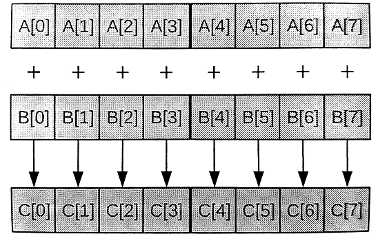

#3.4 内核和OpenCL编程模型

执行模型API能让应用管理OpenCL命令的执行。OpenCL命令通过数据转移和内核执行，对具体应用数据进行处理，从而执行一些有意义的任务。OpenCL内核也属于OpenCL应用中的一部分，并且这一部分实实在在的执行在设备上。与CPU并发模型类似，OpenCL内核在语法上类似于标准的C函数；不同在于添加了一些关键字，OpenCL的并发模型由内核实现构成。使用系统多线程API或OpenMP，开发一款执行在CPU上的并发应用时，开发者会考虑物理设备上有多少线程可以使用(比如：CPU核数)，如果使用的线程数量超过了可用的线程数，那么在物理线程不够用的基础上，多个线程会在不同时刻互相切换执行。OpenCL在的编程上，通常是以最细粒度的并行。OpenCL的一般性体现在，接口的通用性和底层内核直接映射物理资源。接下来展示三个不同版本的向量加法：①串行C实现，②多线程C实现，③OpenCL C实现。代码3.1中使用串行的方式实现向量加法(C语言)，其使用一个循环对每个元素进行计算。每次循环将两个输入数组对应位置的数相加，然后存储在输出数组中。图3.3展示了向量加法的算法。


// Perform an element-wise addition of A and B and store in C.
// There are N elements per array.

void vecadd(int *C, int *A, int *B, int N){
  for (int i = 0; i < N; ++i){
    C[i] = A[i] + B[i];
  }
}


代码3.1 串行加法实现

图3.3 向量加法的算法表示，其中每个元素可以单独进行加的操作

对于一个多核设备，我们要不就使用底层粗粒度线程API(比如，Win32或POSIX线程)，要不就使用数据并行方式(比如，OpenMP)。粗粒度多线程程序需要对任务进行划分(循环次数)。因为循环的迭代次数特别多，并且每次迭代的任务量很少，这时我们就需要增大循环迭代的粒度，这种技术叫做“条带处理”[1]。多线程版的代码如代码3.2所示。


// Perform an element-wise addition of A and B and store in C.
// There are N elements per array and NP CPU cores.

void vecadd(int *C, int *A, int *B, int N, int NP, int tid){
  
  int ept = N / NP; // 每个线程所要处理的元素个数

  for (int i = tid * ept; i < (tid + 1) * ept; ++i){
    C[i] = A[i] + B[i];
  }
}


代码3.2 分块处理向量加法，使用粗粒度多线程(例如，使用POSIX CPU线程)。输入向量上的不同元素被分配到不同的核上。


// Perform an element-wise addition of A and B and store in C.
// N work-items will be created to execute this kernel.
__kernel
void vecadd(__global int *C, __global int *A, __global int *B){
  int tid = get_global_id(0); // OpenCL intrinsic函数
  c[tid] = A[tid] + B[tid];
}


代码3.3 OpenCL版向量相加内核

##3.4.1 处理编译和参数

##3.4.2 设备上执行kernel