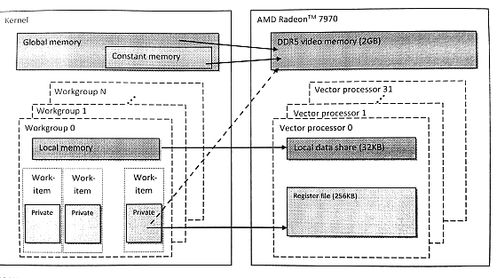

#3.5 OpenCL内存模型

内存与计算平台之间有特别大的差异。为了代码的可移植性，OpenCL的方法是是定义一个抽象的内存模型，其目的是为了能让程序员写出的代码，对应到供应商所提供的实际硬件内存上。OpenCL内存模型只描述了，OpenCL平台为了OpenCL程序所外现的内存(系统)结构。内存模型必须定义，如何让执行单元看到其所需要值的方式。内存模型是保证OpenCL程序正确性的关键。

OpenCL内存模型可以实现程序员所期望的功能：对应内存操作能保证其发生的顺序，以及内存中实际的数值(当读取操作返回时)。OpenCL中内存一致性模型基于ISO C11编程语言的内存模型。第6章和第7章会详细讨论内存模型的内存，包括一致性内存模型和共享虚拟内存。这里我们只需要了解一下OpenCL中定义的不同内存类型，其中内存区域是对抽象内存模型的补足。了解了这些之后，我们就可以执行第一个OpenCL程序了。

##3.5.1 内存对象

OpenCL内核通常需要对输入和输出数据进行分类(例如，数组或多维矩阵)。在程序执行前，需要保证输入数据能够在设备端访问到。为了将数据转移到设备端，首先做的事就是封装出一个内存对象。为了让输出数据产生，需要开辟相应大小的空间，以及将开辟的空间封装成一个内存对象。OpenCL定义了三种内存类型：数组、图像和管道。

**数组缓存**

*Buffer*类型类似于C语言中的数据(使用malloc函数开辟)，这种类型中数据在内存上是连续的。理论上，这种类型可以在设备端以指针的方式使用。OpenCL API `clCreateBuffer()`为这种类型分配内存，并返回一个内存对象。

```c++
cl_mem
clCreateBuffer(
  cl_context context,
  cl_mem_flags flags,
  size_t size,
  void *host_ptr,
  cl_int *errcode_ret)
```

该API类似于C中malloc()函数，或C++中的new操作。创建一个数组需要知道其长度和创建在哪一个上下文上；创建之后，与该上下文相关联的设备就能看到这个内存对象。对于第二个标识参数，是用来指定设备端可对内存进行的操作，可以是“只读”、“只写”或“读写”。其他标识需要在数组创建的时候指定。比较简单的选项是使用主极端的指针来初始化一段数组。我们能看到的是OpenCL数组是与上下文进行关联，而非某个设备，所以数据转移的时间在运行时确定。数组转移到指定的设备上，或是从指定的设备转移到其他地方都由OpenCL运行时，根据数据的依赖性进行管理。

**图像对象**

图像也是OpenCL内存对象，其抽象了物理数据的存储，以便“设备指定”的访存优化。与数组不同，图像数组数据不能直接访问。因为相邻的数据并不保证在内存上连续存储。使用图像的目的就是为了发挥硬件空间局部性的优势，并且可以利用设备硬件加速的能力。

```c++
cl_mem
clCreateImage(
  cl_context context,
  cl_mem_flags flags,
  const cl_image_format *image_format,
  const cl_image_desc *image_desc,
  void *host_ptr,
  cl_int *errcode_ret)
```

图像没有数据类型或维度，图像对象的创建需要通过描述符，让硬件了解这段内存数据的具体信息。图像对象中的每个元素通过格式描述符来表示(cl_image_format)。格式描述符用于描述图像元素在内存上是如何存储，以及使用通道的信息。通道序(*channel order*)指的是由多少个通道元素组成一个图像元素(例如，RGBA就是由四个通道值组成一个像素，其通道序为4)，并且通道类型(*channel type*)指定了每个元素的大小。大小可以设置为1到4字节中的任意值，这样就能表现多种不同的格式(从整型到浮点)。其他数据元通过图像描述符(cl_image_desc)提供，其包括了图像的类型和维度。第4章我们会看到一个使用图像的例子。第6章和第7章，我们将详细的讨论图像的架构设计和评估。

为了支持图像类型，在设备端OpenCL C专门提供了用于读写图像数据的内置函数。硬件供应商可以通过这些函数，在底层单独对图像访问进行优化，或者利用硬件加速功能提高图像访存的速度。与数组相比，图像读写函数需要额外的参数，并且这些函数根据图像的具体数据类型进行使用。例如，`read_imagef()`函数就适用于读取浮点型的数值，`read_imageui()`函数就使用与读取无符号整型的数值。这些函数在使用的数据类型上有些不同，但在读取方面至少需要有一组访问坐标和一个采样器对象。采样器可以指定，设备访问到图像外部时，这些不存在的数据应该如何获取，是否使用差值，以及是否对坐标进行归一化。写入图像需要手动将数据转换成对应的存储数据格式(例如，对应的通道和对应的数据大小)，目的坐标也需要手动的进行转换。

之前的OpenCL标准中，内核不允许对一个图像对象即进行写入，又进行读取。不过，OpenCL 2.0放松了这一要求，其提供的一系列同步操作，能让编程者安全的在同一内核中对同一图像对象进行读和写。

**管道对象**

管道内存对象就是一个数据元素(被称为*packets*)队列，其和其他队列一样，遵循FIFO(先进先出)的方式。一个管道对象具有一个写入末尾点，用于表示元素由这里插入；并且，具有一个读取末尾点，用于表示元素由这里移除。要创建一个管道对象时，需要调用OpenCL API `clCreatePipe()`，这里需要提供包的大小和管道中可容纳包的最大数量(例如，创建时固定了管道中可容纳包的最大值)。函数`clGetPipeInfo()`可以返回管道中包的大小和整体大小(也就是可容纳包的最大值)。属性参数是一个保留参数，在OpenCL 2.0阶段，这个值只能传NULL。

```c++
cl_mem
clCreatePipe(
  cl_context context,
  cl_mem_flags flags,
  cl_uint pipe_packet_size,
  cl_uint pipe_max_packets,
  const cl_pipe_properties *properties,
  cl_int *errcode_ret)
```

任意时间点，只能有一个内核向管道中存入包，并且只有一个内核从管道中读取包。为了支持“生产者-消费者”设计模式，一个内核与写入末尾点连接(生产者)，同时另一个内核与读取末尾点连接(消费者)。同一个内核不能同时对一个管道进行读取和存入。

图像和管道都是不透明的数据结构，其只能通过OpenCL C的内置函数进行访问(比如，`read_pipe()`和`write_pipe()`)。OpenCL C也提供相应的函数，可以保留管道的读取点和写入点。内置函数允许管道在工作组级别上进行访问，而不需要单独访问每个工作项，并且能在工作组级别上执行同步。第6章将会对管道进行更多的讨论。

##3.5.2 数据转移命令

内核执行之前，通常需要将主机端的数据拷贝到OpenCL内存对象的所分配的空间中。创建数组或图像可以调用不同的创建API(`clCreate*()`)。将主机指针作为`clCreate*()`的参数用于初始化OpenCL内存对象。这种方式可以隐式的进行数据传输，并不需要程序员为之担心。内存对象初始化之后，运行时就需要保证数据依据依赖关系，以正确的顺序和时间转移到设备端。

虽然，数据转移交给运行时进行管理，但是我们通常出于对性能的考虑(将在第6章进行讨论)，常常希望能够手动进行数据传输。显式的数据传输也需要检索主机端的内存空间。因此，通常情况下使用显式数据传输命令，在内存对象被内核调用之前，为其写入相应的数据到设备端；以及，在内存对象最后一次使用之后，读取其数据到主机端。假设我们的内存对象是一个数组，主机端和设备端的内存互传需要使用到下面两个API：`clEnqueueWriteBuffer()`和`clEnqueueReadBuffer()`。设备端使用的内存与主机内存通常是离散的，当命令执行时，数据可能就已经传输到设备端了(比如，使用PCIe总线)。读取和写入内存对象的API十分相似。`clEnqueueWriteBuffer()`的参数列表如下所示：

```c++
cl_int
clEnqueueWriteBuffer(
  cl_command_queue command_queue,
  cl_mem buffer,
  cl_bool blocking_write,
  size_t offset,
  size_t cb,
  const void *ptr,
  cl_uint num_events_in_wait_list,
  const cl_event *event_wait_list,
  cl_event *event)
```

除了命令队列，该函数还需要数组型的内存对象，所要传输的数据大小，以及数组的偏移。偏移量和传输数据可以将原始数据的一个子集进行传输。如果需要数据传输完成再返回，blocking_write参数可以设置成CL_TRUE；如果设置成CL_FALSE，则以更加高效的异步方式进行传输，且函数会立即返回，无需等到数据完全传输完再返回。写入和读取数组的操作将在本章最后的例子中演示。

##3.5.3 内存区域

OpenCL将内存划分成主机内存和设备内存。主机内存可在主机上使用，其并不在OpenCL的定义范围内。使用对应的OpenCL API可以进行主机和设备的数据传输，或者通过共享虚拟内存接口进行内存共享。而设备内存，指定是能在执行内核中使用的内存空间。

OpenCL将设备内存分成了四种，这四种内存分别代表了不同的内存区域，如图3.6所示。


图3.6 内存区域和其在OpenCL内存模型中的界限

这些内存空间都与OpenCL内核有关。一个内核中，不同区域对应有不同的关键字，关键字用来指定变量使用哪种内存进行创建，或数据具体所存储的位置。内存区域在逻辑上是不想交的，并且不同区域的数据要被其他区域使用，是否需要进行数据转移是由内核开发者来控制。每个内存区域都有其各自的性能特性。由于性能特性的缘故，存储到不同区域的数据在读取时具有很大的性能差异。

下面简单的来描述一下每个内存区域：

- 全局内存对于执行内核中的每个工作项都是可见的(类似于CPU上的内存)。当数据从主机端传输到设备端，数据就存储在全局内存中。有数据需要从设备端传回到主机端，那么对应的数据需要存储在全局内存中。其关键字为`global`或`__global`，关键字加在指针类型描述符的前面，用来表示该指针指向的数据存储在全局内存中。例如，本章最后的的例子中，OpenCL C代码中`global int *A`代表A指针指向的数据为与全局内存中(虽然我们会看到的A实际位于私有内存中)。

- 常量内存并非为只读数据设计，但其能让所有工作项同时对该数据进行访问。这里存储的值通常不会变化(比如，某个数据变量存储着π的值)。OpenCL的内存模型中，常量内存为全局内存的子集，所以内存对象传输到全局内存的数据可以指定为“常量”。使用关键字`constant`或`__constant`将相应的数据映射到常量内存。

- 局部内存中的数据，只有在同一工作组内的工作项可以共享。通常情况下，局部内存会映射到片上的物理内存，例如：软件管理的便笺式存储器。比起全局内存，局部内存具有更短的访问延迟，以及更高的传输带宽。调用`clSetKernelArg()`设置局部内存时，只需要传递大小，而无需传递对应的指针，相应的局部内存会由运行时进行开辟。OpenCL内核中，使用`local`或`__local`关键字来描述指针，从而来定义局部内存(例如，`local int *sharedData`)。不过，数据也可以通过关键字`local`，静态申明成局部内存变量(例如，`local int[64]`)。

- 私有内存只能由工作项自己进行访问。局部变量和非指针内核参数通常都在私有内存上开辟。实践中，私有变量通常都与寄存器对应。不过，当寄存器不够私有数组使用是，这些溢出的数据通常会存储到非片上内存(高延迟的内存空间)上。



图3.7 AMD Radeon HD 7970 GPU具体硬件存储器与OpenCL内存模型的对应关系

##3.5.4 通用地址空间
