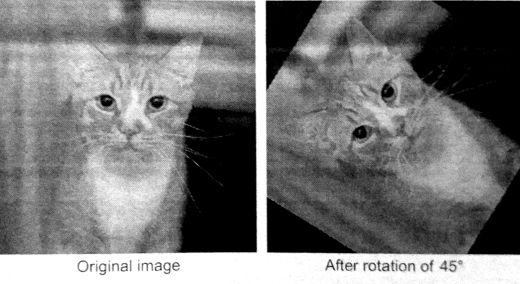

#4.3 图像旋转

旋转在常规的图像处理中都会用到，比如在图形匹配、图像对齐，以及其他基于图像的算法。本节旋转例子的输入是一张图，输出是一张旋转了Θ度的图。旋转完成后，就如同图4.2中所示。



图4.2 旋转了45°的图像。超出图像范围的部分会返回黑色像素。

假设其中一个像素点的坐标为(x, y)，中心旋转点的坐标为(x0, y0)，当原始坐标旋转Θ度时，该点的新坐标为(x', y')。这些数据的计算公式如下所示：

```
x' = cosΘ(x - x0) + sinΘ(y - y0)
y' = -sinΘ(x - x0) + cosΘ(y - y0)
```

根据以上的等式，可以清楚的了解每个像素点坐标的计算都是独立的。注意，每个输入和输出的坐标值不一定是整数。因此，我们就要利用OpenCL内置函数支持浮点坐标计算，并且内部支持的线性差值方式也能生成高质量的输出图像。

如果将工作项映射到输出图像的位置上，那么工作项的全局ID就对应着输出的(x', y')，并使用上面的等式进行计算。该例子中我们以图像的中间点，作为旋转中心点。根据之前的等式，我们能推算出原始的坐标位置，以便每个工作项完成其计算：

```
x = x'cosΘ - y'sinΘ + x0
y = x'sinΘ + y'cosΘ + y0
```

相关的OpenCL C伪代码如下：
```c++
gidx = get_global_id(0);
gidy = get_global_id(1);
x0 = width / 2;
y0 = height / 2;
x = gidx * cos(theta) - gidy * sin(theta) + x0
y = gidx * sin(theta) + gidy * cos(theta) + y0
```

代码清单4.3中展示了如何使用OpenCL内核处理图像旋转。第3章，我们提到过图像，其对象对编程者是不透明，必须使用相关类型的内置函数。这个内核代码中，我们使用了`read_imagef()`(第38行)用来处理浮点数据。如同所有用来访问图像的函数一样，`read_imagef()`会返回一个具有4个元素的矢量类型。当我们对单通道数据进行处理(会在之后进行描述)，我们只需要在读取函数之后访问.x即可(第38行)。当我们调用写入图像的函数时，会将一个具有4个元素的矢量直接写入图像中，而不管数据实际的类型，这里就需要硬件进行适当的处理。因此，在调用`write_imagef()`时，我们必须将结果转换为一个float4矢量类型(第41行)。


__constant sampler_t sampler = 
  CLK_NORMALIZED_COORDS_FALSE |
  CLK_FILTER_LINEAR           |
  CLK_ADDRESS_CLAMP;
  
__kernel
void rotation(
  __read_only image2d_t inputImage,
  __write_only image2d_t ouputImage,
  int imageWidth,
  int imageHeigt,
  float theta)
{
  /* Get global ID for ouput coordinates */
  int x = get_global_id(0);
  int y = get_global_id(1);
  
  /* Compute image center */
  float x0 = imageWidth / 2.0f;
  float y0 = imageHeight / 2.0f;
  
  /* Compute the work-item's location relative
   * to the image center */
  int xprime = x - x0;
  int yprime = y - y0;
  
  /* Compute sine and cosine */
  float sinTheta = sin(theta);
  float cosTheta = cos(theta);
  
  /* Compute the input location */
  float2 readCoord;
  readCoord.x = xprime * cosTheta - yprime * sinTheta + x0;
  readCoord.y = xprime * sinTheta + yprime * cosTheta + y0;
  
  /* Read the input image */
  float value;
  value = read_imagef(inputImage, sampler, readCoord).x;
  
  /* Write the output image */
  write_imagef(outputImage, (int2)(x, y), (float4)(value, 0.f, 0.f, 0.f));
}


代码清单4.3 图像旋转内核

内核4.3代码中使用图像采样器(sampler_t sampler)，用来描述如何访问图像。采样器指定如何处理访问到的图像位置，比如，当访问到图像之外的区域，或是当访问到多个坐标时，不进行差值操作。

访问到的坐标不是就被标准化(比如，取值范围在0到1之间)，就是使用基于像素值地址。使用CLK_NORMALIZED_COORDS_FALSE标识指定基于像素地址的寻址。OpenCL支持很多用于处理跨边界访问寻址方式。本节例程中，我们将是用CL_ADDRESS_CLAMP用来指定，当访问到图像之外的区域，会将RGB三个通道的值设置成0，并且将A通道设置成1或0(由图像格式决定)。所以，超出范围的像素将会返回黑色。最后，采样器允许我们指定一种过滤模式。过滤模式将决定将如何返回图像所取到的值。选项CLK_FILTER_NEAREST只是简单的返回离所提供左边最近的图像元素。或者使用CLK_FILTER_LINEAR将坐标附近的像素进行线性差值。本节图像旋转的例子中，我们将使用线性差值的方式提供质量更加上乘的旋转图像。

之前版本的OpenCL中，全局工作项的数量是由NDRange进行配置，每个维度上工作项的数量必须是工作组数量的整数倍。通常，这就会导致NDRange设置的大小要远大于已经映射的数据。当访问到图像外区域时，编程者不得不传入元数据到内核当中去，用于判断每个工作项所访问到的位置是否合法——本节例子中，就需要将图像的宽和高传入内核当中。访问到非法位置的工作项将不参与计算，有时这样的做法将使内核代码变得奇怪或低效。OpenCL 2.0标准中，设备所需的NDRange中，工作组尺寸在图像边界处可变。这就用到剩余工作组(*remainder work-groups*)的概念，第5章还会继续讨论。将OpenCL的性能特性使用到代码清单4.3中，将会使代码简单，并高效。

之前的例子中，创建程序对象的过程与向量相加中创建程序对象的过程很类似。不过本节的例子中我们在内核中使用的是图像。从一副图中读取图像后，我们将其元素转换为单精度浮点类型，并将其作为OpenCL图像对象的数据来源。

分配图像对象的工作由clCreateImage() API完成。创建图像时，需要指定其维度(1,2,3维)，并且设置其图像空间大小，这些都有图像描述器(类型为cl_image_desc)对象来完成。像素类型和通道布局都有图像格式(类型为cl_image_format)来指定。图像中所存储的每个元素都为四通道，分别为R,G,B和A通道。因此，一个图像将使用CL_RGBA来表示，其每个元素向量中通道的顺序。或者，一副图像中的每个像素只用一个值来表示(比如：灰度缩放图或数据矩阵)，数据需要使用CL_R来指定图像为单通道。当在数据格式中指定数据类型，并通过签名和尺寸组合标识的方式来指定整数类型。例如，CL_SIGNED_INT32代表32bit有符号整型数据，CL_UNSIGNED_INT8与C语言中无符号字符类型一样。单精度浮点数据，可以使用CL_FLOAT指定，并且这个标识用在了本节的例子中。

代码清单4.4展示了在主机端创建输入和输出图像的例子。图像对象创建完成之后，我们使用`clEnqueueWriteImage()`将主机端的输入数据传输到图像对象当中。


/* The image descriptor describes how the data will be stored
 * in memory. This descriptor initializes a 2D image with no pitch */
cl_image_desc desc;
desc.image_type = CL_MEM_OBJECT_IMAGE2D;
desc.image_width = width;
desc.image_height = height;
desc.image_depth = 0;
desc.image_array_size = 0;
desc.image_row_pitch = 0;
desc.image_slice_pitch = 0;
desc.num_mip_levels = 0;
desc.num_samples = 0;
desc.buffer = NULL;

/* The image format descibes the properties of each pixel */
cl_image_format format;
format.image_channel_order = CL_R; // single channel
format.image_channel_data_type = CL_FLOAT;

/* Create the input image and initialize it using a
 * pointer to the image data on the host */
cl_mem inputImage = clCreateImage(context, CL_MEM_READ_ONLY, &format, &desc, NULL, NULL);

/* Create the output image */
cl_mem ouputImage = clCreateImage(context, CL_MEM_WRITE_ONLY, &formatm, &desc, NULL, NULL);

/* Copy the host image data to the device */
size_t origin[3] = {0,0,0}; // Offset within the image to copy form
size_t region[3] = {width, height, 1}; // Elements to per dimension
clEnqueueWriteImage(queue, inputImage, CL_TRUE,
  origin, region, 0 /* row-pitch */, 0 /* slice-pitch */,
  hostInputImage, 0, NULL, NULL);


代码清单4.4 为旋转例程创建图像对象

旋转例程的完整代码在代码清单4.5中展示。

/* System includes */
#include <stdio.h>
#include <stdlib.h>
#include <string.h>

/* OpenCL includes */
#include <CL/cl.h>

/* Utility functions */
#include "utils.h"
#include "bmp-utils.h"

int main(int argc, char **argv)
{
  /* Host data */
  float *hInputImage = NULL;
  float *hOutputImage = NULL;
  
  /* Angle for rotation (degrees) */
  const float theta = 45.f;
  
  /* Allocate space for the input image and read the
   * data from disk */
  int imageRows;
  int imageCols;
  hInputImage = readBmpFloat("cat.bmp", &imageRow, &imageCols);
  const int imageElements = imageRows * imageCols;
  const size_t imageSize = imageElements * sizeof(float);
  
  /* Allocate space for the ouput image */
  hOutputImage = (float *)malloc(imageSize);
  if (!hOutputImage){ exit(-1); }
  
  /* Use this to check the output of each API call */
  cl_int status;
  
  /* Get the first platform */
  cl_platform_id platform;
  status = clGetPlatformIDs(1, &platform, NULL);
  check(status);
  
  /* Get the first device */
  cl_device_id device;
  status = clGetDeviceIDs(platform, CL_DEVICE_TYPE_GPU, 1, &device, NULL);
  check(status);
  
  /* Create a context and associate it with the device */
  cl_context context;
  context = clCreateContext(NULL, 1, &device, NULL, NULL, &status);
  check(status);
  
  /* Create a command-queue and associate it with the device */
  cl_command_queue cmdQueue;
  cmdQueue = clCreateCommandQueue(context, device, 0, &status);
  check(status);
  
  /* The image descriptor describes how the data will be stored
   * in memory. This descriptor initializes a 2D image with no pitch */
  cl_image_desc desc;
  desc.image_type = CL_MEM_OBJECT_IMAGE2D;
  desc.image_width = width;
  desc.image_height = height;
  desc.image_depth = 0;
  desc.image_array_size = 0;
  desc.image_row_pitch = 0;
  desc.image_slice_pitch = 0;
  desc.num_mip_levels = 0;
  desc.num_samples = 0;
  desc.buffer = NULL;
  
  /* The image format describes the properties of each pixel */
  cl_image_format format;
  format.image_channel_order = CL_R; // single channel
  format.image_channel_data_type = CL_FLOAT;
  
  /* Create the input image and initialize it using a
   * pointer to the image data on the host */
  cl_mem inputImage = clCreateImage(context, CL_MEM_READ_ONLY, &format, &desc, NULL, NULL);
  
  /* Create the ouput image */
  cl_mem outputImage = clCreateImage(context, CL_MEM_WRITE_ONLY, &format, &desc, NULL, NULL);
  
  /* Copy the host image data to the device */
  size_t origin[3] = {0,0,0}; // Offset within the image to copy from
  size_t region[3] = {imageCols, imageRows, 1}; // Elements to per dimension
  clEnqueueWriteImage(cmdQueue, inputImage, CL_TRUE,
    origin, region, 0 /* row-pitch */, 0 /* slice-pitch */, hInputImage, 0, NULL, NULL);
    
  /* Create a program with source code */
  char *programSource = readFile("image-rotation.cl");
  size_t programSourceLen = strlen(programSource);
  cl_program program = clCreateProgramWithSource(context, 1, (const char **)&programSource, &programSourceLen, &status);
  check(status);
  
  /* Build (compile) the program for the device */
  status = clBuildProgram(program, 1, &device, NULL, NULL, NULL);
  if (status != CL_SUCCESS){
    printCompilerError(program, device);
    exit(-1);
  }
  
  /* Create the kernel */
  cl_kernel kernel;
  kernel = clCreateKernel(program, "rotation", &status);
  check(status);
  
  /* Set the kernel arguments */
  status = clSetkernelArg(kernel, 0, sizeof(cl_mem), &inputImage);
  status |= clSetKernelArg(kernel, 1, sizeof(cl_mem), &outputImage);
  status |= clSetKernelArg(kernel, 2, sizeof(int), &imageCols);
  status |= clSetKernelArg(kernel, 3, sizeof(int), &imageRows);
  status |= clSetKernelArg(kernel, 4, sizeof(float), &theta);
  check(status);
  
  /* Define the index space and work-group size */
  size_t globalWorkSize[2];
  globalWorkSize[0] = imageCols;
  globalWorkSize[1] = imageRows;
  
  size_t localWorkSize[2];
  localWorkSize[0] = 8;
  localWorkSize[1] = 8;
  
  /* Enqueue the kernel for execution */
  status = clEnqueueReadImage(cmdQueue, outputImage, CL_TRUE, origin, region, 0 /* row-pitch */, 0 /* slice-pitch */, hOutputImage, 0, NULL, NULL);
  check(status);
  
  /* Write the output image to file */
  writeBmpFloat(hOutputImage, "rotated-cat.bmp", imageRows, imageCols, "cat.bmp");
  
  /* Free OpenCL resources */
  clReleaseKernel(kernel);
  clReleaseProgram(program);
  clReleaseCommandQueue(cmdQueue);
  clReleaseMemObject(inputImage);
  clReleaseMemObject(outputImage);
  clReleaseContext(context);
  
  /* Free host resources */
  free(hInputImage);
  free(hOutputImage);
  free(programSource);
  
  return 0;
}


代码清单4.5 图像旋转主机端的完整代码