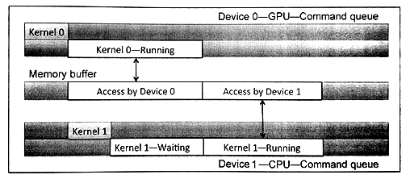

#5.1 命令和排队模型

OpenCL基于任务并行/主机控制模型，其每个任务均为数据并行。其通过使用每个设备上线程安全的命令队列作为该模型的保证。内核、数据搬移，以及其他操作并非是使用者调用一些运行时函数，就能简单的执行。这些操作使用异步入队操作进入指定队列，并在未来的某个时刻执行该命令。执行的同步点在于主机端的命令队列和设备端的命令队列。

OpenCL命令队列中命令可以是，执行内核、内存数据转移，或是同步命令。要想了解命令的执行结果，只能等到命令队列到达同步点才能看到。下面列举几个主要的同步点：

- 使用指定OpenCL时间等待某个命令完成
- 调用`clFinish()`函数，将阻塞主机端的线程，直到命令队列中的命令全部执行完毕
- 执行一次阻塞式内存操作

##5.1.1 阻塞式内存操作

阻塞式内存操作应该是最常见，且最简单的同步方式。这种操作会阻塞主线程的进行，直到内存数据传输完成。数据传输API都具有一个参数，可以决定是否使用阻塞的方式进行数据传输。`clEnqueueReadBuffer()`中的blocking_read就是用来控制是否使用阻塞方式进行数据传输。

```c++
cl_int 
clEnqueueReadBuffer(
  cl_command_queue command_queue,
  cl_mem buffer,
  cl_bool blocking_read,
  size_t offset,
  size_t size,
  const void *ptr,
  cl_uint num_events_in_wait_list,
  const cl_event *event_wait_list,
  cl_event *event)
```

将数据从设备端获取，或是传输到设备端，通常都会使用同步的方式进行内存操作。例如，从设备端获取数据到主机端时，在传输没有完成前，主机是不能访问其数据的，否则将会导致一些未定义的行为。因此，blocking_read参数可以设置成CL_TRUE，用以阻塞主线程，直到数据传输完成主线程才能继续进行下面的操作。使用这种方式进行同步，可以直接获取数据，之后就不需要在进行额外的同步了。阻塞和非阻塞式内存操作将在第6章进行详细讨论。

##5.1.2 事件

这里先回顾一下第3章中，事件可以用来指定命令之间的依赖关系。每个`clEnqueue*`API都可以产生一个与其入队命令相关的事件对象，我们可以通过事件对象来查询命令的状态，并且指定对应命令所要依赖命令所对应的事件队列。生成的事件可以作为一种依赖机制，以便OpenCL运行时实现其所要执行的任务图[作者注1]。

随着命令入队和出队，以及命令的执行，事件都会持续的更新其状态。命令状态列举如下：

- 已入队(Queued)：该命令已经在命令队列中占据了一席之地
- 已提交(Submitted)：该命令已经从命令队列中移除，并提交给设备执行
- 已就绪(Ready)：该命令已经准备好在设备端执行
- 已运行(Running)：该命令已经在设备端执行，但并未完成
- 已完成(Ended)：该命令已经在设备端执行完成
- 已结束(Complete)：该命令以及其子命令都已经执行完成

因为异步是OpenCL天生的特性，所以其API不能简单的返回错误码，或与命令执行相关的性能数据(可以通过API提供的参数获取入队时的错误码，以及入队的时间点)。不过，OpenCL也提供查询命令相关错误码的机制。要查询对应的错误码，需要提供该命令对应的时间对象。甚至，命令执行无误完成也有对应的错误码。查询事件对象的状态，需要调用`clGetEventInfo()`API，将CL_EVENT_COMMAND_STATUS_EXECUTION_STATUS传递给param_name参数即可。

```c++
cl_int
clGetEventInfo(
  cl_event event,
  cl_event_info param_name,
  size_t param_value_size，
  void *param_value,
  size_t *param_value_size_ret)
```

当命令完全正确无误完成，相关事件对象的状态会设置成CL_COMPLETE。注意“完全”值的是其命令本身，以及其相关子命令，都需要正确完成。子命令指的是内核入队其子内核，子内核的运行称为子命令。有关设备端入队的内容会在之后(本章)进行讨论。

当命令非正常结束，为正常完成时，相关事件对象的状态通常会返回一个负值。这种情况下，当有命令异常终止，那么使用同样上下文对象的命令队列则不再可用，相关命令队列上的命令将会全部退出。

调用`clWaitForEvents()`将会阻塞主机端的执行，直到指定的事件对象链表上相关的命令全部解除，才会解除对主机主线程的阻塞。

```c++
cl_int
clWaitForEvent(
  cl_uint num_events,
  const cl_event *event_list)
```

##5.1.3 命令栅栏和命令标识

想要不阻塞主机端线程，并想要同步的方式也存在，就是入队一个命令栅栏。命令栅栏从原理来说，与在主机端调用`clWaitForEvent()`类似，但这种方式不会显式的进行处理，而是运行时库会对其进行内部处理。入队栅栏需要使用`clEnqueueBarrierWithWaitList()`API[译者注2]，可将命令队列列表当做参数输入。如果没有提供命令队列，栅栏会等待之前入队的所有命令完成(后续入队的命令将不会执行，直到前面所有的命令执行完成)。

标识(Marker)的作用于栅栏类似，其使用`clEnqueueMarkerWithWaitList()`API[译者注2]进行入队。栅栏和标识的区别在于，标识不会阻塞之后入队的命令。因此，当设备完成所有指定事件时，标识就允许编程者去查询指定事件状态，而不会阻碍其中一些命令的执行。

使用这两种同步命令，以及事件的方式，就给OpenCL提供了更多的可能，能够完成更加复杂的任务图，完成高难度的动作。这种方式在使用乱序命令队列时尤为重要，其能在运行时优化命令的调度。

##5.1.4 事件回调

OpenCL允许用户为事件对象注册回调函数。当事件对象到达某一指定状态时，回调函数便会调用。`clSetEventCallback()`函数就可为OpenCL的事件对象注册回调函数：

```c++
cl_int
clSetEventCallback(
  cl_event event,
  cl_int command_exec_callback_type,
  void (CL_CALLBACK *pfn_event_notify)(
    cl_event event,
    cl_int event_command_exec_status,
    void *user_data),
  void *user_data)
```

command_exec_callback_type用来指定回调函数在何时调用。可能的参数只有：CL_SUBMITTED，CL_RUNNING和CL_COMPLETE。

这种设置是为了保证相关回调函数的调用顺序。举个例子，不同的回调函数注册了事件状态为CL_SUBMITTED和CL_RUNNING，当事件对象的状态发生变化就能确保按照正确的顺序进行，而回调函数的调用顺序就无法保证正确。我们将在第6章和第7章讨论到，内存状态只能在事件对象为Cl_COMPLETE是确定(事件对象为其他状态时，无法确定内存状态)。

##5.1.5 使用事件分析性能

确定一个命令的执行事件时，会将对应的数值传递给事件对象，命令在不同的状态时都由对应的计时器进行计时。不过，这样的计时需要开启命令队列的计时功能，需要在创建命令队列时，将CL_QUEUE_PROFILING_ENABLE加入properties参数内，提供给`clCreateCommandQueueWithProperties()`。

任何与命令相关的时间对象，都可以通过调用`clGetEventProfilingInof()`获取性能信息：

```c++
cl_int
clGetEventProfilingInfo(
  cl_event event,
  cl_profiling_info param_name,
  size_t param_value_size,
  void *param_value,
  size_t *param_value_size_ret)
```

通过对不同状态的耗时查询，编程者可以知道命令每个状态在队列中的耗时情况。同样，编程者通常就想知道对应命令实际运行的时间(比如：数据传输的耗时情况，内核执行的耗时情况)。为了确定命令整体耗时情况，可以将CL_PROFILING_COMMAND_START和CL_PROFILING_COMMAND_END作为实参传入param_name中。如果需要将子内核执行的时间计算在内，就需要传递CL_PROFILING_COMMAND_COMPLETE作为实参。OpenCL定义的计时器，其计时的精度必须是纳秒级别。

##5.1.6 用户事件

目前我们所见到的事件对象都是入队命令API，通过其参数中提供一个事件对象指针的方式所产生的事件对象。不过，当编程者想要OpenCL命令等待一个主机端的事件，应该怎么办呢？例如，编程者可能需要OpenCL进行数据传输，这个数据传输任务需要等待某个文件更新之后再进行传输。为了应对这种情况，OpenCL 1.2标准中添加了用户事件(user event)。

```c++
cl_event
clCreateUserEvent(
  cl_context context,
  cl_int *errcode_ret)
```

这样创建的事件对象，其状态就是由应用开发者来决定，而非OpenCL运行时来决定。用户事件的状态数量会有限制，用户事件可以为“已提交”状态(CL_SUBMITTED)，也可为“已完成”(CL_COMPLETE)，或是某一个错误状态。当一个用户事件对象创建，其执行状态就被设置成CL_SUBMITTED。

用户事件的状态可以通过`clSetUeserEventStatus()`进行设置：

```c++
cl_int clSetUserEventStatus(
  cl_event event,
  cl_int execution_status)
```

execution_status参数指定需要设置的新执行状态。用户事件对象可以将状态设置为两种，第一种可为CL_COMPLETE；第二种可为一个负数，表示一个错误。设置成负值意味着所有入队的命令，需要等待该用户事件终止才能退出。还有一点需要注意的是，`clSetUserEventStatus()`只能对一个用户事件对象使用一次，也就是对一个对象只能设置一次执行状态。

##5.1.7 乱序任务队列

第3章和第4章中的OpenCL例子都是以顺序命令队列(默认方式)进行。顺序命令队列能保证命令将按入队的顺序，在对应的设备上执行。不过，OpenCL队列也可以乱序执行。一个乱序队列时没有什么执行顺序可言的。硬件支持直接内存访问(direct memory access, DMA)引擎可以并行启动多个计算单元，或设备可以同时执行多个内核。像这样的硬件设备就完全可以支持OpenCL运行时使用乱序命令队列，其可以自由且并行的调度这些操作(就是无法保证哪个命令先执行)。

创建命令队列的API(`clCreateCommandQueueWithProperties()`)可以设置乱序的标志位，这种方式到现在我们还没有尝试过。只要属性参数中包含CL_QUEUE_OUT_OF_ORDER_EXEC_MODE_ENABLE就可以产生支持乱序执行的命令队列。需要注意的，支持乱序的队列需要创建在支持乱序执行的设备上。

代码清单5.1中，展示了使用乱序命令队列程序主机代码的一部分，其包括写入输入数组、执行两个内核，并且将数据读取到主机端。这一系列命令的顺序由特定的事件对象指定，事件对象中记录了各个命令的依赖关系。任务图就由这些事件对象创建，这样即使是乱序执行也能保证命令执行的顺序正确。其中内存传输函数是非阻塞的，并且最后的同步，是显式的在主机端对读取事件对象使用`clWaitForEvents()`完成的。使用非阻塞形式的内存传输需要格外注意，因为当使用乱序队列时，可能会有潜在的传输区域或执行区域的重叠。


// -----------------------------
// Relevant host program
// -----------------------------

// Create the command-queue
cl_command_queue_properties properties = CL_QUEUE_OUT_OF_ORDER_EXEC_MODE_ENABLE;
cl_command_queue queue = clCreateCommandQueueWithProperties(context, devices[0], &properties, NULL);

// Declare the events
cl_event writeEvent, kernelEvent0, kernelEvent1, readEvent;

// Create the buffers
cl_mem input = clCreateBuffer(context, CL_MEM_READ_ONLY, 32 * sizeof(float), NULL, NULL);
cl_mem intermediate = clCreateBuffer(context, CL_MEM_READ_WRITE, 32 * sizeof(float), NULL, NULL);
cl_mem outpt = clCreateBuffer(context, CL_MEM_WRITE_ONLY, 32 * sizeof(float), NULL, NULL);

// Write the input data
clEnqueueWriteBuffer(queue, input, CL_FALSE, 0, 32 * sizeof(float), (void *)hostInput, 0, NULL, &writeEvent);

// Set up the execution unit dimensions used by both kernels
size_t localws[1] = {8};
size_t globalws[1] = {32};

// Enqueue the first kernel
clSetKernelArg(kernel, 0, sizeof(cl_mem), (void *)&input);
clSetKernelArg(kernel, 1, sizeof(cl_mem), (void *)&intermediate);
clSetKernelArg(kernel, 2, 8 * sizeof(float), NULL);
clEnqueueNDRangeKernel(queue, kernel, 1, NULL, globalws, localws, 1, &kernelEvent0, &kernelEvent1);

// Read output data
EnqueueNDRangeKernel(queue, output, CL_FALSE, 0, 32 * sizeof(float), (void *)&hostOutput, 1, &kernelEvent1, &readEvent);

// Block until the read has completed
clWaitForEvents(1, &readEvent);

clReleaseEvent(writeEvent);
clReleaseEvent(kernelEvent);
clReleaseEvent(readEvent);


程序清单5.1 同时入队两个内核，使用事件来控制依赖关系

乱序命令队列并不保证其执行顺序就是乱序的。鲁棒性较好的应该应该避免死锁的发生，当意识到有死锁发生的可能，那最好的方式就是串行执行入队的命令。我们再来看一下程序清单5.1的代码，即便是是顺序执行，程序也能得到正确的结果。不过，当“写入输入数据”和“执行第一个内核”这两个任务在源码中颠倒，那么开发者还是期望队列是以乱序的方式执行。但是，当队列顺序执行的时候，就会产生死锁，因为内核执行事件将会等待写入操作的完成。



图5.1 同一上下文中创建多个不同设备的命令队列。展示两个不同的设备的执行情况，同一个上下文中的设备可以共享相应的内存区域。

-----

[译者注1] ”任务图“的概念类似于OpenVX中Graph的概念，有兴趣的读者可以查阅OpenVX的官方文档。

[译者注2]这两个API很相似，不过其描述不同。下面引用OpenCL官方的描述：
> clEnqueueBarrierWithWaitList: Enqueues a barrier command which waits for either a list of events to complete, or if the list is empty it waits for all commands previously enqueued in command_queue to complete before it completes. This command blocks command execution, that is, any following commands enqueued after it do not execute until it completes. This command returns an event which can be waited on, i.e. this event can be waited on to insure that all events either in the event_wait_list or all previously enqueued commands, queued before this command to command_queue, have completed.

> clEnqueueMarkerWithWaitList： Enqueues a marker command which waits for either a list of events to complete, or if the list is empty it waits for all commands previously enqueued in command_queue to complete before it completes. This command returns an event which can be waited on, i.e. this event can be waited on to insure that all events either in the event_wait_list or all previously enqueued commands, queued before this command to command_queue, have completed.