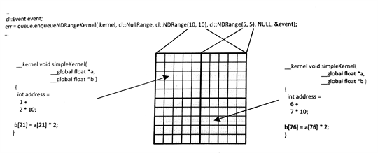

#5.3 内核执行域:工作项、工作组和NDRange

OpenCL的执行以内核为中心。内核代码用来表示一个内核线程所要做的所有事情，其代码由OpenCL C语言完成。一个内核代码第一眼看去和C函数很类似：OpenCL C语言中，内核可以看成一个C函数。OpenCL内核具有一组参数列表，还有局部变量(类似Pthread中线程的局部变量)，以及标准的控制流。OpenCL内核的并行性，使其区别于C函数。我们在第3章仅用OpenCL工作项，并行化处理了一维空间中的大量数据。本节，我们将继续延伸讨论OpenCL执行模型中，工作项、工作组，以及NDRange的层级结构。

内核的执行需要运行时提供对应的启动/调度接口，该函数就是`clEnqueueNDRangeKernel()`。内核在调度中会产生大量工作项，共同执行内核“函数体”。使用启动接口之后，就会产生一个NDRange，其包括了内核执行的维度，以及每个维度上的工作项的数量。一个NDRange可以定义为1，2和3维，用于规划处工作项的“格子图”，工作项简单和直接的结构非常适合并行执行。将OpenCL模型映射到硬件端，每个工作项都运行在一个硬件单元上，这个单元称为“执行元素”(Processing element, PE)。OpenCL内核执行时，可能有多个工作项依次工作在同一个PE上。

内核内部调度中，每一个工作项都是独立的。OpenCL中会有意限制工作项间的同步。松散的执行模型就允许OpenCL程序去扩展设备，可用于具有超级多核心的规模化设备。可扩展的设备通常都会抽象成一种层级结构——特别是内存系统——OpenCL也为其设备的执行空间提供了一种层级结构。

为了更加灵活的支持具有大量核心的设备，OpenCL将各维度上执行的工作项等分成多个工作组。每个工作组内，工作项可以进行某种程度上的交互。OpenCL标准定义了一个完整的工作项，可以并发执行在同一计算单元上。这种执行方式对于同步很重要。并发执行中的工作组内允许局部同步，不过也会对交互有所限制，以提高可扩展性。当应用中设计到需要在全局执行空间内，任务需要互相交互，那么这种OpenCL并行应用无非是低效的。使用工作组会有更高率的交互，因为一个计算单元通常映射到一个核芯上，因此工作组内交互通常都是在一块共享缓存或暂存存储器上。

通过定义更多的工作组，OpenCL内核将扩展的越来越大，并且有越来越多的线程同时在设备上执行(有更多的工作项和工作组都会在同时执行在同一设备上)。OpenCL工作项可以看做win32或POSIX线程。OpenCL层级执行模式只需要一步，因为工作项都位于工作组内，这样只需要将工作组(数量要少于工作项)映射到硬件线程的上下文中即可。这样做和单指令多数据的执行很相似，就如向量执行N操作，只使用了N个时钟周期。不过，OpenCL中子向量(工作项)可以拥有自己的程序计数器，直到到达同步点。用GPU来举个例子，64个工作项(英伟达为32个)可以同时被一个硬件线程处理(在SIMD单元上)，这种方式在AMD的架构中就是大家熟知的波阵面(wavefront)；在英伟达架构中，则称为线程束(warp)。即使每次执行的工作项数量被锁定，不过不同的工作项可以执行内核内不同的指令序列。这种情况会发生在内核中有分支语句时，因为If else语句具有不同的记过，所以不同的工作项会对条件状态进行评估后执行。不过工作项页有可能在同一波或束中，走进不同的分支中，这时硬件有责任将不该执行的分支结果舍弃。这种情况就是众所周知的分歧(divergence)，并且这也会对极大影响内核执行的效率，因为工作项执行了冗余的操作，并且这些操作的结果最后都要舍弃。

这样的执行模型，就需要所有的工作项具有自己的程序计数器，这种方式要比显式使用SIMD多媒体扩展流指令在x86的处理上简单许多。因为SIMD的执行方式，需要注意给定的设备，了解对应设备支持SSE的版本，OpenCL的工作组尺寸通常是SIMD最大向量宽度的倍数。工作组尺寸查询API为`clGetKernelWorkGroupInfo()`，需要CL_KERNEL_PREFERRED_WORK_GROUP_SIZE_MULTIPLE作为实参传入*param_name*中。

OpenCL定义了一些内置函数，可以在内核内部获取工作项在执行区域内的具体位置。这些函数通常都有一个维度参数，这里定义为uint dimension。其值可以为0、1和2，可以通过维度的设置获取NDRange参数在入队时的设置：

- uint get_work_dime():返回入队时所设定的工作维度数量
- size_t get_global_size(uint dimension):返回对应维度上的全局工作项数量
- size_t get_global_id(uint dimension):返回对应维度上对应全局工作项索引
- size_t get_local_size(uint dimension):返回对应维度上工作组的数量。如果内核所分配的工作项在工作组内数量不均匀，那么剩余工作组(之后章节中讨论)将返回与均匀工作项不同的值
- size_t get_enqueued_local_size(uint dimension):返回对应维度上均匀区域内工作项数量
- size_t get_num_groups(uint dimension):返回当前工作项索引，以该工作项所属组的起始位置为偏移
- size_t get_group_id(uint dimension):返回当前工作组的索引。也可通过获取该工作组的第一个元素的全局索引，然后除以工作组的大小得到当前工作组索引

图5.4 执行程序清单5.5中的简单内核。展示NDRange中不同区域工作项的具体工作。

##5.3.1 同步

##5.3.2 工作组栅栏

##5.3.3 内置工作组函数

##5.3.4 谓词评估函数

##5.3.5 广播函数

##5.3.6 并行原语函数