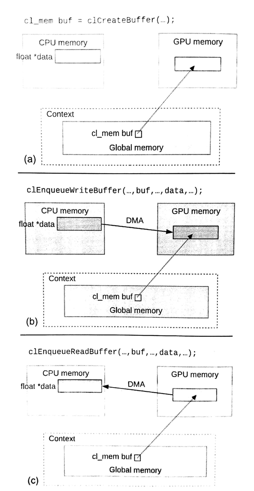

#6.2 内存管理

当使用OpenCL主机端API创建内存对象，这些内存对象都在全局空间内分配，可以被上下文上所有的设备使用。虽然，OpenCL中只设置了一块全局内存，不过实际使用的很多异构系统具有很多设备，这些设备对共享地址空间有严格的要求，并且可能不同设备的内存在物理设备上是分开的——比如CPU的内存和离散GPU的内存。这样的话，在内核运行前，运行时可能就要将数据在各种设备的内存间进行拷贝。即使在共享内存系统中，数据不需要重复拷贝，不过内核所需要的数据还是要拷贝到设备的层级缓存中。当存在数据拷贝，那么拷贝阶段某一设备上的内存可能是不一致的，这种状态的内存数据对于上下文中的其他设备是可见的。存在有潜在的拷贝和不一致状态，那么如何保证最后一次复制的数据就是我们期望的数据呢？

后面的章节中，我们将讨论使用细粒度*共享虚拟内存*(SVM)的内存序和可见性。现在我们假设我们使用的内存对象是默认内存对象，即*非共享虚拟内存*(non-SVM)。当使用默认内存对象时，OpenCL松散的一致性模型不会让多个内核对在同一时间，对同一个内存对象进行操作。没有其他内核进行数据的修改，就保证了直到该内核执行完成，其他内核才能可见已经修改的内存。如果没有这种机制，那么运行时为一个内存对象创建了多个副本，两个内核对里面的内容进行修改，也就等同于对同一内存进行修改，那么最后得到结果必然是其中一个内核的结果覆盖另一个的结果；如果我们在让另外一个内核再去修改这块内存，那么这种修改就是会导致未定义的行为。除了需要编程者对自己的程序负责，运行时也要保证正确的数据在正确的时间，出现在正确的位置。将松散的内存模型和运行时对内存管理的责任结合在一起，就能让执行更加可移植，并且将对编程者的影响降到最低。

另外，OpenCL标准的设计者也知道在实际中，数据传输是低效的，并且数据搬运会降低应用的性能。因此，OpenCL提供了一些命令，允许编程者设置“如何”，以及“在哪里”开辟这段内存；以及“在哪里”和“在何时”进行数据搬运。根据运行OpenCL系统的差别，不同方式分配方式和搬运方式对于应用的性能有很大的影响。下面两节中，就来聊聊怎么分配内存对象，以及转移内存对象上的数据——基于数组对象(虽然我们使用数组对象来做例子，不过也可以对图像对象进行相同的操作)。管道对象和数组与图像对象不同，其数据不能在主机端进行直接访问，所以就不存在搬运的问题。

##6.2.1 管理普通内存对象

回到内存对象的穿件，我们使用`clCreateBuffer()`，并传入一系列flags，以及host_ptr。这里在展示一些`clCreateBuffer()`的声明：

```c++
cl_mem
clCreateBuffer(
  cl_context context,
  cl_mem_flags flags,
  size_t size,
  void *host_ptr,
  cl_int *errcode_ret)
```

通过flags传入一些选项，就能告诉运行时应该“怎么”和“在哪里”分配该数组空间，并且host_ptr用来初始化数组对象，或将主机端的数据拷贝到内存对象中。本节将了解当没有与分配相关的选项传入flags时，内存对象时如何工作的。下节中将了解，编程者在设置这些分配选项时，内存如何在硬件上进行分配。

通常，OpenCL不会指定在某个物理存储空间内分配内存对象——其将默认内存都看做"全局内存"。例如，运行时会决定是在CPU主存上分配内存，或是在离散GPU的内存上分配内存。这很像为数据创建多个空间，并且根据需要进行转移最后的数据副本。

当创建一个对象时，可以让主机端提供一个合法指针host_ptr用来初始化创建的内存对象，并且将CL_MEM_COPY_HOST_PTR作为实参传入flags，这就指定了内存对象中的数据是从主机端进行拷贝得到。创建内存对象的过程不会产生对应的事件对象，我们可以假设内存对象是在拷贝完host_ptr上的数据后才返回的。图6.1中展示运行时如何在数组对象创建和初始化、传递内核参数，以及从内存对象中读回数据中，数据转移的过程。


图6.1 注意，运行时也直接在创建和初始化了设备端的内存对象(a)使用主机内存创建和初始化一个数组对象。(b)内核之前，隐式的将主机端的数据搬运到设备端。(c)显式的将设备内存中的数据搬回主机端。

一般来说，从一个设备到另一个设备的转移数据的效率很低——第8章中，我们将讨论基于现代CPU和GPU，比较不同数据互传方式的内存带宽。为了让编程者更高效的转移数据，OpenCL提供了一些API(使用不同方式)专门用来进行数据搬移。其中最佳的选择要依赖于所实现的算法，以及目标系统的特点。

第一组命令就是显式的从主机端或设备端，将数据拷贝到设备端或主机端，其运行方式如图6.2所示。这两个命令为`clEnqueueWriteBuffer()`和`clEnqueueReadBuffer()`。`clEnqueueWriteBuffer()`的声明如下：

```c++
cl_int
clEnqueueWriteBuffer(
  cl_command_queue command_queue,
  cl_mem buffer,
  cl_bool blocking_write,
  size_t offset,
  size_t size,
  const void *ptr,
  cl_uint num_events_in_wait_list,
  const cl_event *event_wait_list,
  cl_event *event)
```



图6.2 数据搬运：显式读写命令。(a)创建一个为初始化的内存对象。(b)内核执行之前，将主机端数据传入设备端。(c)内核执行之后，将设备端数据传回主机端。

`clEnqueueWriteBuffer()`和`clEnqueueReadBuffer()`的声明很类似，除了使用blocking_write和blocking_read。声明中可以看出，数据是在buffer和ptr之间进行传输。其中写命令就将主机端的数据在设备端进行拷贝(在全局内存中进行备份)，并且读命令就将设备端的数据在主机端进行拷贝。注意这里需要有命令队列参与。这样就需要指定设备，对其内存副本进行初始化。当然，对于大多数应用的编程者，他们是知道数据要拷贝到什么设备上去的，并且指定对应的命令让运行时知道应该向哪个设备进行数据拷贝，从而就能避免多余的拷贝过程。这种设计也让运行时能更快的将相应的数据传递到对应的设备，以便在内核执行时供内核使用。

编程者可以通过设置offset和size，来决定从哪里拷贝多少byte个数据。注意ptr是作为主机端读或写的起始地址，offset用来决定数组对象的起始地址，而ptr的初始地址则由编程者决定。

这种数据传输是可以是异步的。当使用异步方式调用`clEnqueueReadBuffer()`时，函数返回时我们无法知晓拷贝过程是否完成，直到我们通过同步机制——通过事件机制，或调用`clFinish()`。如果我们想在函数返回时就完成拷贝，则需要将CL_TRUE作为实参传入blocking_write或blocking_read中。这样，下面的代码中A和B打印出来的将是两个不同的结果(即使outputBuffer最终应该是这个结果)。对于C的打印是能确定从outputBuffer拷贝出来的结果。


int returnedArray[16];
cl_mem outputBuffer;
cl_event readEvent;

// Some code that fills the returned array with 0s and invokes kernels
// that generates a result in outputBuffer
printf("A: %d\n", returnedArray[3]);

clEnqueueReadBuffer(
  commandQueue,
  outputBuffer, /* buffer */
  CL_FALSE, /* nonblocking read*/
  0,
  sizeof(int) * 16,
  returnedArray, /* host ptr */
  0,
  0,
  &readEvent);
  
printf("B: %d\n", returnedArray[3]);
clWaitForEvents(1, &readEvnet);
printf("C: %d\n", returnedArray[3]);


##6.2.2 管理带有分配选项的内存对象


