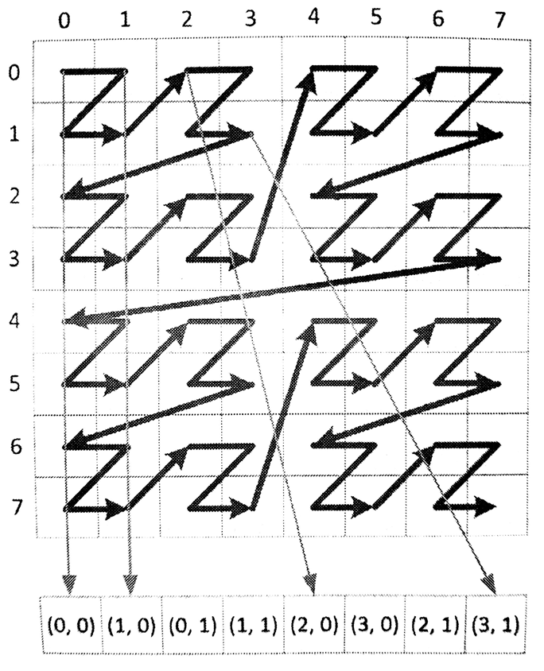

#7.2 全局内存

OpenCL C中使用类型修饰符__global(或global)描述的指针就是全局内存。全局内存的数据可以被执行内核中的所有工作项(比如：设备中的计算单元)所访问到。不同类型的内存对象的作用域是不同的。下面的小节中，将详细讨论每种全局内存对象。

##7.2.1 数组

__global可以用来描述一个全局数组。数组中可以存放任意类型的数据：标量、矢量或自定义类型。无论数组中存放着什么类型的数据，其是通过指针以顺序的方式进行访问，并且执行内核可以对数组进行读写，也可以设置成针对内核只读或只写的数组。

数组数据和C语言的数组几乎没有任何区别，在C语言怎么使用的，就可以在OpenCL内核代码中怎么使用：

```c++
float a[10], b[10];
for (int i = 0; i < 10; ++i){
  *(a + 1) = b[i];
}
```

上面的例子中，通过数组a和b的指针对其内容进行访问。其中尤其重要的是，其中内存以连续的方式顺序开辟，a数组中第i个元素可以表示为a[i]，其指针地址为a+i。我们可以使用sizeof()操作来计算数组中元素的大小，然后计算对应指针的偏移，以便将指针从一种类型转换成另一种类型。底层代码中，指针转换是相当有用的方式，对于OpenCL这种以C语言驱动的标准来说，也自然会支持这种方式。

下面的例子展示了如何在OpenCL内核代码中,使用数组对象支持自定义类型：

```c++
typedef struct AStructure{
  float a;
  float b;
}AStructure;

__kernel void aFunction(
  __global AStructure *inputOutputBuffer){

  __global AStructure *inputLocation =
    inputOutputBuffer + get_global_id(0);
  __global AStructure *outputLoacation =
    inputOutputBuffer + get_global_size(0) + get_global_id(0);

  outputLoacation->a = inputLocation->a * -1;
  outputLoacation->b = (*inputLocation).b + 3.f;
}
```


##7.2.2 图像

图像对象也会在全局内存上开辟，其与数组不同，其不能映射成一个指针。图像对象维度有一维、维和三维，其分别对应图像类型image1d_t、image2d_t和image3d_t。OpenCL 2.0之前的标准，只允许图像对象只读或只写，无法在内核中同时进行图像的读和写的操作。这样的设计是因为GPU硬件支持高速缓存和高速滤波器。从2.0标准开始，支持对对同一图像对象的读和写。

图像对象是不透明的对象。虽然我们可以根据坐标对数据进行访问，但是我们无法知道其在内存上的相对位置。在实际内存上，看上去在图像上相邻的两个点，可能在内存地址上距离很远。这样的特性，使得图像对象更适合进行参数化的读取，而非直接通过指针获取对应位置的数据，因此OpenCL中提供了一些内置函数，用来获取图像数据。对于读取图像的内置函数有：read_imagef()、read_imagei()和read_imageui()，分别可读取单浮点、整型和无符号整型数据。每个图像读取函数都具有三个参数：图像对象、图像采样器和坐标位置。

可以传入整型和浮点型坐标值。返回值通常是具有四个元素的矢量。例如，下面读取二维浮点数据的函数声明：

```c++
float4
read_imagef(
  image2d_t image,
  sampler_t samper,
  int2 coord)

float4
read_imagef(
  image2d_t image,
  sampler_t samper,
  float2 coord)
```

注意这里传入的坐标使用的是int2和float2类型。这是因为指定的二维图像类型，image2d_t。对于一维图像类型，传入int和float类型的坐标即可。对于三维图像类型，需要传入int4和float4类型的数据，其中最后一个分量不会是用到(译者注：在OpenCL中type3类型其实均是由type4类型表示)。

如果图像数据不足四个通道，那么大多数图像类型将返回0，用来表示未使用的颜色通道，返回1代表着alpha(透明度)通道。例如，读取单通道图像(CL_R)，那么返回的float4类型中就会是这样(r, 0.0, 0.0, 1.0)。

读取函数的第二个参数是采样器。其表示硬件或运行时系统如何看待图像对象。创建采样器对象可以在内核端创建sampler_t类型对象，也可以在主机端使用`clCreateSampler()`API进行创建。下面就是使用常量声明的采样器：

```c++
__constant sampler_t sampler =
  CLK_NORMALIZED_COORDS_FALSE |
  CLK_FILTER_NEAREST          |
  CLK_ADDRESS_CLAMP;

__kernel void samplerUser(
  __read_only image2d_t sourceImage,
  __global float *outputBufffer){

  float4 a = read_imagef(
    sourceImage,
    sampler,
    (float2)(
      (float)(get_global_id(0)),
      (float)(get_global_id(1))));

  outputBuffer[get_global_id(1) * get_global_size(0) + get_global_id(0)] = a.x + a.y + a.z + a.w;
}
```



##7.2.3 管道


