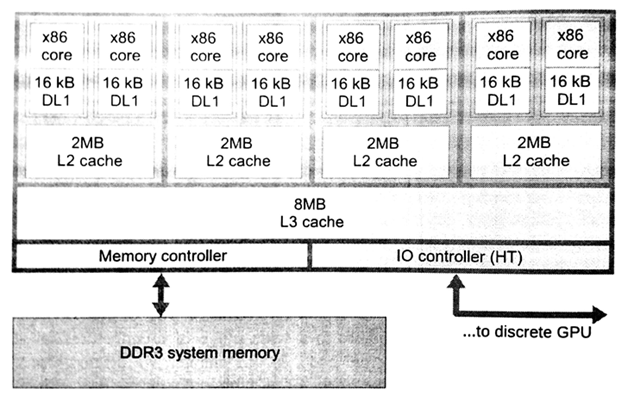
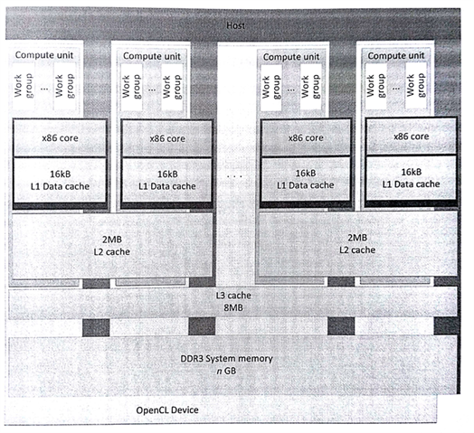
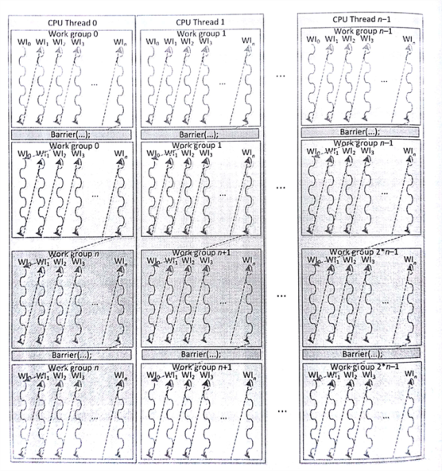

#8.1 AMD FX-8350 CPU

AMD的OpenCL实现可以运行在所有x86架构的CPU上，以及AMD显卡上。所有主机端代码统一执行在x86架构的CPU上。不过，AMD的OpenCL实现也可以将x86架构的处理器作为设备，让x86设备运行OpenCL C代码。图8.1展示了FX-8350 CPU的内部架构，该图用来描述x86架构与OpenCL实现之间的映射关系。

要在OpenCL运行时将FX-8350 CPU作为设备，需要使用clGetDeviceIDs()获取该设备句柄。然后将设备句柄作为设备对象传入clCreateContext()，clCreateCommandQueue()和clBuildProgram()。当要使用CPU作为OpenCL C的执行设备时，需要向clGetDeviceIDs()传入CL_DEVICE_TYPE_CPU标识(或CL_DEVICE_TYPE_ALL)。



图8.1 基于AMD打桩机架构的高配CPU——FX-8350

CPU中，OpenCL可以使用的核数有8个。如果将整个CPU作为一个独立设备，那么最好是每个核都有独立的命令队列，用来分散并行负载量，这种负载均衡的方式在系统中效率最高。当然在OpenCL中也可以使用设备划分的扩展方式，将CPU划分成多个设备。

##8.1.1 运行时实现

OpenCL使用CPU是，运行时在每个核上创建了一个线程(例如，线程池)，以便OpenCL内核的执行。另一个主管理线程会根据队列上的任务，将不同的任务分配给不同的线程，同时将正在执行的任务从队列上移除。任意给定的OpenCL内核可能包含成千上万个工作组(其参数以及相应内存都需要提前准备好)。

OpenCL使用栅栏的方式提供细粒度的同步。在一个基于CPU的传统系统中，操作系统会对线程间通讯进行管理，操作系统会进行一定粒度的同步，使得并行实现更加高效。另外，如果将一个工作组分配到多个CPU核上回造成共享缓存的问题。为了缓解这个问题，OpenCL CPU运行时实现将一个工作组部署在一个CPU核(线程)上。OpenCL工作组中的工作项会按顺序执行(串行)。当前工作组中所有工作项执行完成后，将执行下一个工作组中的工作项。这样来看的话，虽然有很多工作组可以同时执行，但是工作组中的线程并不是并行的关系。图8.2中描绘了OpenCL在FX-8350 CPU上的映射关系。



图8.2 OpenCL在FX-8350 CPU上的映射关系。该芯片将CPU和GPU集成在了一起。

OpenCL中使用栅栏进行同步时，工作项在工作组是并发的。所有线程必须到达栅栏处，才能继续下面的操作。CPU作为设备时，栅栏操作等于是一个工作项终止后，另一个工作项启动；不过，这对于操作系统不现实，因为操作系统会对不同优先级的线程进行处理(例如，中断某个线程，让另一个线程进行)。因此，当整个工作组属于一个线程时，就不会出现线程优先级的问题。AMD的OpenCL CPU运行时实现中，栅栏操作会使用到setjmp和longjmp指令。setjmp将会保存系统状态(保护现场)，longjmp将会读取保存了的系统状态，继续之前的执行状态[1]。不过，运行时会为了配合硬件的分支预测器和保证程序栈对齐，针对这两个函数提供两个自定义版本。图8.3展示了CPU线程在工作组中的工作流。



图8.3 x86架构下工作组运行情况

因为工作项的执行方式是串行的，所以当在内核中使用栅栏操作时，原本可以并行的工作组也需要将执行方式转变为串行。

使用setjmp指令时，工作项的数据将从工作项的栈中弹出到寄存器中。为了减少缓存争夺和未命中的情况，并提高层级缓存的利用率，栈数据存放在缓存的何处需要仔细考虑。另外，工作项栈数据是交错存储在内存上，以减少访存冲突，并且数据保存在一个较大的内存页中，以保证物理地址映射的连续性，减少CPU使用转换内存的压力。

##8.1.2 工作项内的向量化操作

AMD打桩机微架构具有128位向量寄存器，可以用来处理各种版本SSE和AVX指令。OpenCL C包括一系列向量类型：float2, float4, int4等等。对于数学操作来说，有OpenCL C提供了对应的向量版本，式例如下：

```c++
float4 a = intput_data[location];
float4 b = a + (float4)(0.f, 1.f, 2.f, 3.f);
output_data[location] = b;
```

在AMD打桩机微架构上，这些向量都会保存在寄存器中，并且在编译过程中会将这些操作翻译成SSE和AVX指令。这里提供了很重要的性能优化。向量的加载和存储操作，会使用底层代码进行，以提高内存操作的效率。目前，单个工作项可以使用SIMD向量：我们在8.2节将会看到在GPU端的操作与CPU端的区别。

##8.1.3 局部内存

AMD打桩机设计中并未对便签式内存提供专用的硬件。CPU通常会为了减少访存延迟，会有很多层缓存。局部数据通常为了更加高效的访问数据，会将其映射到CPU缓存上，这样虽然没有为便签式内存提供专用硬件，但是开发者还是享受到了来自硬件的访存加速。为了提高缓存的命中率，局部内存在每个CPU线程上都会开辟一段，并且局部内存可以被工作组中的工作项重复使用。对于串行的工作组来说(因为栅栏、数据竞争或内存冲突)，就不需要局部内存，从而会造成之后的缓存未命中。局部内存另外的好处是，减少了内存频繁开辟的开销。图8.4展示了局部内存与AMD CPU缓存的映射关系。


图8.4 工作组(0)的内存地址空间对应的是打桩机CPU的缓存。

虽然，在CPU上使用局部内存也会有潜在的性能收益，不过使用局部内存会给一些应用带来性能上的负面影响。如果内核中数据具有很好的局部性(比如，矩阵相乘的一部分)，之后使用局部内存用来存放需要多次使用到的数据，从而免去对数据的多次拷贝，并且数据存储在L1缓存上，访存效率极高。在这种情况下，如果可用的缓存过小，则会导致性能退化，过小的缓存会造成数据争夺缓存位置，从而增加未命中率和数据拷贝的开销。

-------

[1] J. Gummaraju, L.Morichetti, M. Houstion, B. Snder, B.R. Gaster, B. Zheng, Twin peaks: a software platform for heterogeneous computing on general-purpose and graphics processors. in: PACT 2010: Proceedings of the Nineteenth International Conference on Parallel Architectures and Complilation Techniques. Septerber 11-15, 2010, Vienna, Austria.  Association for Computing Machinery, 2010.
