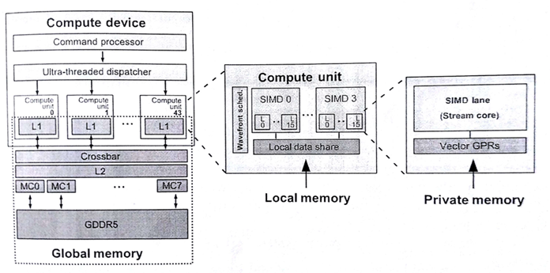
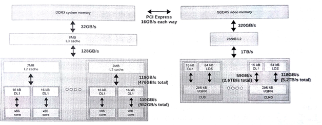
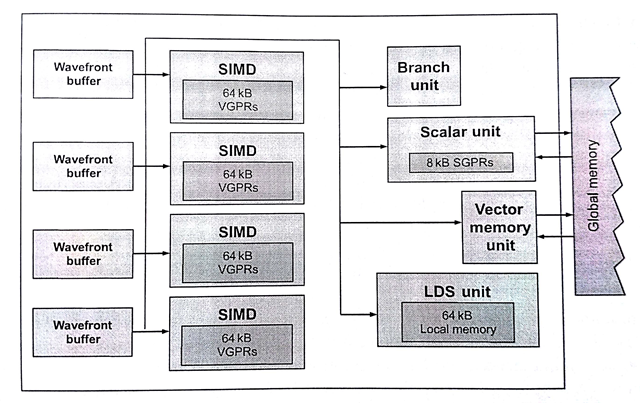

#8.2 AMD RADEON R9 290X GPU

本节我们将讨论一下AMD GPU中的“波面阵”(在NVIDIA显卡中称为“线程块”)。这个概念是有助于我们区分OpenCL工作项和CUDA线程。不过，有时会无可避免的使用“线程”这个词来对GPU的工作方式进行描述。本书中我们将会使用“线程”来描述硬件线程。虽然，本节指定的设备为AMD Radeon R9 290X GPU，但是硬件线程与工作项映射的关系、线程调度和抢占的考量，以及内存系统的布局，不同厂商的同类产品其实很相似。

GPU上OpenCL的目标代码与CPU上的差别很大。读者应该还记得，图像处理器主要用来对3D图像进行渲染。这种设计让使得资源的优先级有所不同，与CPU架构也有很大的区别。目前GPU市场上，GPU的一些主要特性的差距越来越小，这些特性我们在第2章讨论过：

1. 执行宽SIMD：大量执行单元对不同的数据，执行相同的指令。
2. 大量多线程：GPU计算核支持并发大量线程。
3. 硬件便签式内存：物理内存可由编程者控制。

下面罗列出来的区别则更加微妙，不过其根据工作分配和交互对应用性能进行提高：

- 支持硬件同步：并发线程间支持细粒度交互。
- 硬件管理任务分配：工作队列管理与负载均和由硬件控制。

硬件同步能为计算单元中的多个波面阵减少同步开销，并且细粒度交互的开销非常低。

GPU为任务分发提供广阔的硬件空间，因为图像处理器支持三维图像。游戏任务在显卡的流水线上交错排布，让图形任务的管理变得更加复杂。图8.5中展示了OpenCL模型在AMD Radeon R9 290X GPU映射关系，其架构包含一个命令处理器和工作组生成器(生成工作组供硬件调度)。调度器会将计算任务分配到设备的44个核上。有关计算单元的内容将在8.2.2中详细讨论。

图8.5 OpenCL执行模型和内存模型在Radeon R9 290X上的映射

为了使用GPU获得高性能加速，调度需要十分高效。对于图像处理器，波面阵调度的开销必须很低，因为工作块可能很小(例如，一个像素只包含三个元素)。因此，当我们需要使用GPU获取较高的性能时，我们需要：

- 提供大量的内核任务供硬件分发
- 如果内核过小，考虑将内核进行合并

为每个内核提供足够工作，这样就能持续的占用工作组的流水线，所以调度器总能收到很多的任务，并且调度器通常会将给多的任务推到SIMD单元上。所以我们希望，设备每一次的吞吐可以创建大量的波面阵发送给GPU。

第二点是因为OpenCL设备支持队列模式。当OpenCL运行时选择执行相关设备上任务队列中的任务时，运行时会扫描队列中的任务，并选择合适大小的任务进行执行。这种任务由一个GPU工作命令缓存构成，其命令的执行放置在GPU的前端流水线上。其执行内容包括(1)构建一个队列，(2)将该队列放置在内存的某个位置上，(3)告诉设备这个队列在哪里，(4)要求设备执行这个队列。因为操作阶段这几个步骤是串行的关系，所以对于单个工作块来说，就会导致较高的延迟。另外，GPU在驱动层之下执行内核的过程中，为了能让GPU正常工作，需要在大量执行内核的上下文中进行切换。在CPU端，如果涉及到线程上下文切换，那应用的性能肯定不会太好。所以，如果任务量太小，就会出现多个上下文切换的情况，从而导致应用性能的下降。不过，这里有个开销常量，也就是对于单个工作队列的分配，以及之后对队列上任务执行的开销。通过传递大内核的方(或较长的内核序列)，可以避免这种开销的累积。这样做的目的，就是为了增加每个队列中所要处理的任务量。

##8.2.1 线程和内存系统

图8.6

##8.2.2 指令集和执行单元

图8.7

##8.2.3 资源分配

图8.8

